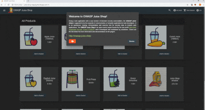
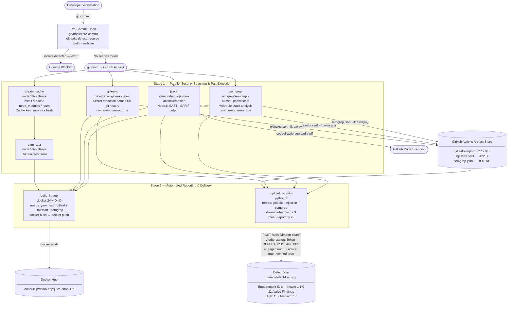
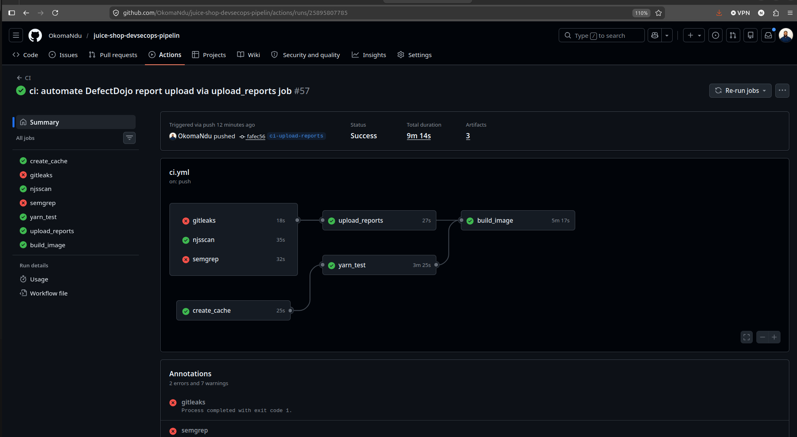
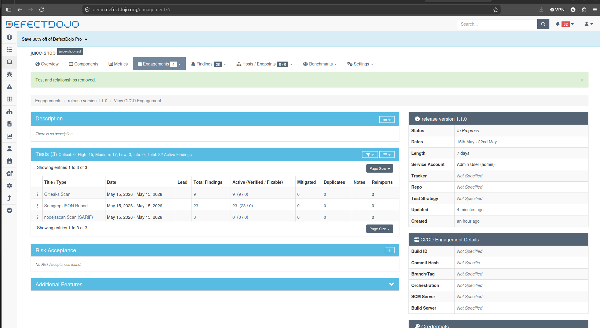
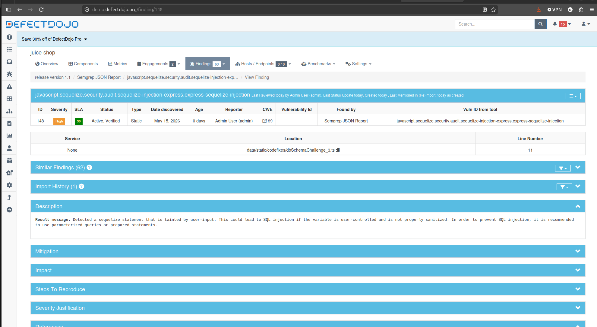

#  OWASP Juice Shop

[](https://owasp.org/projects/#sec-flagships)
[](https://github.com/juice-shop/juice-shop/releases/latest)
[](https://twitter.com/owasp_juiceshop)
[](https://reddit.com/r/owasp_juiceshop)


[](https://codeclimate.com/github/juice-shop/juice-shop/test_coverage)
[](https://codeclimate.com/github/juice-shop/juice-shop/maintainability)
[](https://codeclimate.com/github/juice-shop/juice-shop/trends/technical_debt)
[](https://dashboard.cypress.io/projects/3hrkhu/runs)
[](https://bestpractices.coreinfrastructure.org/projects/223)

[](CODE_OF_CONDUCT.md)

> [The most trustworthy online shop out there.](https://twitter.com/dschadow/status/706781693504589824)
> ([@dschadow](https://github.com/dschadow)) —
> [The best juice shop on the whole internet!](https://twitter.com/shehackspurple/status/907335357775085568)
> ([@shehackspurple](https://twitter.com/shehackspurple)) —
> [Actually the most bug-free vulnerable application in existence!](https://youtu.be/TXAztSpYpvE?t=26m35s)
> ([@vanderaj](https://twitter.com/vanderaj)) —
> [First you 😂😂then you 😢](https://twitter.com/kramse/status/1073168529405472768)
> ([@kramse](https://twitter.com/kramse)) —
> [But this doesn't have anything to do with juice.](https://twitter.com/coderPatros/status/1199268774626488320)
> ([@coderPatros' wife](https://twitter.com/coderPatros))

OWASP Juice Shop is probably the most modern and sophisticated insecure web application! It can be used in security
trainings, awareness demos, CTFs and as a guinea pig for security tools! Juice Shop encompasses vulnerabilities from the
entire
[OWASP Top Ten](https://owasp.org/www-project-top-ten) along with many other security flaws found in real-world
applications!



For a detailed introduction, full list of features and architecture overview please visit the official project page:
<https://owasp-juice.shop>

## Table of contents

- [CI Pipeline](#ci-pipeline)
- [Vulnerability Management: DefectDojo](#vulnerability-management-defectdojo)
- [Setup](#setup)
    - [From Sources](#from-sources)
    - [Packaged Distributions](#packaged-distributions)
    - [Docker Container](#docker-container)
    - [Vagrant](#vagrant)
    - [Amazon EC2 Instance](#amazon-ec2-instance)
    - [Azure Container Instance](#azure-container-instance)
    - [Google Compute Engine Instance](#google-compute-engine-instance)
    - [Heroku](#heroku)
    - [Gitpod](#gitpod)
- [Demo](#demo)
- [Documentation](#documentation)
    - [Node.js version compatibility](#nodejs-version-compatibility)
    - [Troubleshooting](#troubleshooting)
    - [Official companion guide](#official-companion-guide)
- [Contributing](#contributing)
- [References](#references)
- [Merchandise](#merchandise)
- [Donations](#donations)
- [Contributors](#contributors)
- [Licensing](#licensing)

## CI Pipeline

This project implements a **DevSecOps CI pipeline** using [GitHub Actions](https://github.com/features/actions), integrating automated security controls directly into the software delivery lifecycle. The pipeline is triggered on every `git push` and orchestrates seven jobs across two execution stages:

- **Stage 1 — Parallel security scanning and test execution:** `create_cache`, `yarn_test`, `gitleaks`, `njsscan`, and `semgrep` run concurrently, maximising feedback speed.
- **Stage 2 — Gated delivery and automated reporting:** `upload_reports` automatically imports scan artefacts into DefectDojo via REST API; `build_image` builds and pushes the Docker image to the registry. Both run in parallel once Stage 1 completes.

### Pipeline Architecture



Pipeline run #57 (`ci-upload-reports` branch) — **Status: Success | Duration: 9m 14s | Artifacts: 3**. `gitleaks` and `semgrep` exit with non-zero codes as expected (secrets and SAST findings detected), but `continue-on-error: true` ensures `upload_reports` and `build_image` proceed unblocked.



### Job Reference

| Job | Container / Action | Trigger Condition | Output |
|---|---|---|---|
| `create_cache` | `node:18-bullseye` | On every push | Cached `node_modules` / `.yarn` keyed to `yarn.lock` hash |
| `yarn_test` | `node:18-bullseye` | `needs: create_cache` | Test pass/fail result |
| `gitleaks` | `zricethezav/gitleaks:latest` | On every push (`continue-on-error: true`) | `gitleaks.json` uploaded as pipeline artifact |
| `njsscan` | `ajinabraham/njsscan-action@master` | On every push | `results.sarif` uploaded to GitHub Code Scanning + `njsscan.sarif` artifact |
| `semgrep` | `semgrep/semgrep` | On every push (`continue-on-error: true`) | `semgrep.json` uploaded as pipeline artifact |
| `upload_reports` | `python:3` | `needs: [gitleaks, njsscan, semgrep]` | `gitleaks.json`, `njsscan.sarif`, `semgrep.json` imported into DefectDojo via REST API |
| `build_image` | `docker:24` (DinD) | `needs: [yarn_test, gitleaks, njsscan, semgrep]` | `ndubuisip/demo-app:juice-shop-1.2` pushed to Docker Hub |

---

### Scan Report Artefacts

All three security scanning jobs are configured to persist their output reports as downloadable pipeline artefacts using `actions/upload-artifact@v4`. Reports are uploaded unconditionally via `if: always()`, ensuring they are retained regardless of whether the scan job passes or fails. This enables offline triage, integration with external vulnerability management platforms, and audit trail preservation beyond the GitHub Actions log retention window.

**Artefacts produced per pipeline run:**

| Artefact Name | Source Job | Format | Size | Description |
|---|---|---|---|---|
| `gitleaks-report` | `gitleaks` | JSON | ~2.17 KB | Full secret detection output including rule ID, file, line, commit, and entropy per finding |
| `njsscan.sarif` | `njsscan` | SARIF | ~422 Bytes | Node.js SAST findings in SARIF format, compatible with GitHub Code Scanning and external tooling |
| `semgrep.json` | `semgrep` | JSON | ~8.48 KB | Multi-language static analysis findings including rule metadata, severity, and affected code location |

Artefacts are accessible from the **GitHub Actions run summary → Artifacts** section and are available for download for the duration of the configured retention period.

---

### Vulnerability Management: DefectDojo

Scan artefacts produced by Gitleaks, Semgrep, and njsscan are automatically imported into **DefectDojo** — an open-source vulnerability management platform — on every pipeline run via a dedicated `upload_reports` CI job. This eliminates manual report handling, providing a centralised, deduplicated, and auditable vulnerability register that is updated continuously with every code push.

#### Accessing DefectDojo

**Demo Server**

Try out the demo instance at [demo.defectdojo.org](https://demo.defectdojo.org/).

Log in with: `admin / 1Defectdojo@demo#appsec`

> **Note:** The demo instance is publicly accessible and is regularly reset. Do not store sensitive or production data in the demo environment.

**Self-Hosted Quick Start**

To run DefectDojo locally using Docker:

```sh
git clone https://github.com/DefectDojo/django-DefectDojo
cd django-DefectDojo

# Build the containers
docker-compose build

# Start the stack
docker-compose up

# Retrieve the auto-generated admin password (initializer can take up to 3 minutes)
docker-compose logs initializer | grep "Admin password:"
```

Navigate to **http://localhost:8080** and log in with `admin` and the password retrieved from the initializer logs.

---

#### Automated Report Upload — `upload_reports` Job

The `upload_reports` job runs in a `python:3` container and executes only after `gitleaks`, `njsscan`, and `semgrep` have all completed (`needs: [gitleaks, njsscan, semgrep]`). It downloads the three scan artefacts from the GitHub Actions artefact store and imports each one into DefectDojo via the REST API.

**Job sequence:**

```
gitleaks ──┐
njsscan  ──┼──► upload_reports (python:3)
semgrep  ──┘         │
                     ├── download gitleaks-report   → gitleaks.json
                     ├── download njsscan.sarif     → njsscan.sarif
                     ├── download semgrep.json      → semgrep.json
                     ├── pip install requests
                     ├── python3 upload-report.py gitleaks.json
                     ├── python3 upload-report.py njsscan.sarif
                     └── python3 upload-report.py semgrep.json
                                  │
                                  └──► POST /api/v2/import-scan/ → DefectDojo
```

**Authentication:** The API key is stored as a GitHub repository variable (`vars.DEFECTDOJO_API_KEY`) and injected into the job environment as `DEFECTDOJO_API_KEY`. It is never hard-coded in the workflow or the upload script.

#### `upload-report.py` — Script Breakdown

The `upload-report.py` script accepts a single filename argument (`sys.argv[1]`) and maps it to the corresponding DefectDojo `scan_type` before posting to the import API:

| Input File | DefectDojo `scan_type` |
|---|---|
| `gitleaks.json` | `Gitleaks Scan` |
| `njsscan.sarif` | `SARIF` |
| `semgrep.json` | `Semgrep JSON Report` |

**API call configuration:**

```python
url  = 'https://demo.defectdojo.org/api/v2/import-scan/'

data = {
    'active':           True,
    'verified':         True,
    'scan_type':        scan_type,      # mapped from filename
    'minimum_severity': 'Low',
    'engagement':       6               # targets engagement ID 6
}
```

- `active: True` — findings are immediately marked active in the risk register
- `verified: True` — findings are pre-marked as verified, bypassing manual triage for known scanner output
- `minimum_severity: 'Low'` — all severity levels are ingested; no findings are filtered at import
- `engagement: 6` — all reports are imported into a pre-configured DefectDojo engagement, scoping findings to the correct product and release window
- A HTTP `201 Created` response confirms successful import; any other status code prints the response body for debugging

#### Engagement Findings Summary

Following a successful pipeline run, all three scan reports are imported into engagement ID 6 — **release version 1.1.0** — on the **juice-shop** product in DefectDojo. The engagement is scoped to a 7-day CI/CD window (15th–22nd May) and was created 22 minutes after the pipeline run, with the upload completing 19 minutes after creation.

All findings are immediately marked **active and verified**, consistent with `active: True` and `verified: True` set in `upload-report.py`:

| Title / Type | Date | Total Findings | Active (Verified / Fixable) | Mitigated | Duplicates |
|---|---|---|---|---|---|
| Gitleaks Scan | May 15, 2026 | 9 | 9 (9 / 0) | 0 | 0 |
| Semgrep JSON Report | May 15, 2026 | 23 | 23 (23 / 0) | 0 | 0 |
| nodejsscan Scan (SARIF) | May 15, 2026 | 0 | 0 (0 / 0) | 0 | 0 |

**Engagement total: 32 active findings | Critical: 0 | High: 15 | Medium: 17 | Low: 0**



---

#### Open Findings — CWE-798: Hardcoded Credentials (Gitleaks)

The Gitleaks import surfaced **9 active findings** within this engagement, all classified **High severity** and mapped to **CWE-798 — Use of Hard-coded Credentials**. These findings correspond to generic API keys and JWT tokens embedded directly in source files and git history — including `data/static/users.yml`, `lib/insecurity.ts`, and `routes/login.ts`.

> **CWE-798** — *Use of Hard-coded Credentials:* The software contains hard-coded credentials, such as a password or cryptographic key, which it uses for its own inbound authentication, outbound communication to external components, or encryption of internal data.

**Risk:** Hard-coded credentials in version-controlled code represent an irrecoverable secret exposure once pushed to any remote. Rotation alone is insufficient without a full git history rewrite (e.g., `git filter-repo`) to expunge the secret from all historical commits.

**Recommended remediation:**
- Migrate all secrets to environment variables or a secrets manager (e.g., HashiCorp Vault, AWS Secrets Manager)
- Rotate all exposed keys and JWT signing secrets immediately
- Rewrite git history to purge secrets from prior commits
- Enforce gitleaks pre-commit hooks across all developer workstations to prevent recurrence

---

#### Critical Finding — CWE-89: SQL Injection (Semgrep)

Semgrep identified a **CWE-89 SQL Injection** vulnerability at **Finding ID 115**, rated **High severity**, located at `routes/search.ts` line 23.

| Field | Value |
|---|---|
| Finding ID | 115 |
| CWE | CWE-89 — Improper Neutralisation of Special Elements in SQL Commands |
| Severity | High |
| Scanner | Semgrep JSON Report |
| File | `routes/search.ts` |
| Line | 23 |
| Rule | `javascript.sequelize.security.audit.sequelize-injection-express` |

> **CWE-89** — *Improper Neutralization of Special Elements used in an SQL Command ("SQL Injection"):* The software constructs all or part of an SQL command using externally-influenced input from an upstream component, but does not neutralise or incorrectly neutralises special elements that could modify the intended SQL command when it is sent to a downstream component.

**Root cause:** The `routes/search.ts` handler passes unsanitised Express request parameters directly into a Sequelize ORM query without parameterisation — allowing an attacker to manipulate the SQL query structure, extract arbitrary data, or bypass authentication controls.

**Recommended remediation:**
- Replace raw string interpolation with Sequelize parameterised queries (`where: { col: req.query.val }`) or prepared statements
- Apply input validation and allowlisting at the route handler level
- Enforce Semgrep's `p/javascript` ruleset in CI as a mandatory blocking gate (remove `continue-on-error: true`) once the baseline findings are remediated

---

#### Remediation Applied — CWE-89 SQL Injection Fix

Following the Semgrep scan, the SQL injection vulnerability was investigated in DefectDojo. **Finding ID 148** — flagged by the `javascript.sequelize.security.audit.sequelize-injection-express.express-sequelize-injection` rule — confirmed the root cause: a Sequelize query in `data/static/codefixes/dbSchemaChallenge_3.ts` at line 11 was constructing SQL using direct string concatenation of the user-supplied `criteria` parameter.

| Field | Value |
|---|---|
| Finding ID | 148 |
| CWE | CWE-89 — Improper Neutralisation of Special Elements in SQL Commands |
| Severity | High |
| Status | Active, Verified |
| Scanner | Semgrep JSON Report |
| File | `data/static/codefixes/dbSchemaChallenge_3.ts` |
| Line | 11 |
| Rule | `javascript.sequelize.security.audit.sequelize-injection-express.express-sequelize-injection` |
| Similar Findings | 62 |

> **Semgrep description:** *Detected a Sequelize statement that is tainted by user-input. This could lead to SQL injection if the variable is user-controlled and is not properly sanitised. In order to prevent SQL injection, it is recommended to use parameterised queries or prepared statements.*



**Vulnerable code — before fix:**

The query directly interpolated the `criteria` variable into the SQL string using string concatenation, allowing an attacker to inject arbitrary SQL through the search input:

```typescript
models.sequelize.query(
  "SELECT * FROM Products WHERE ((name LIKE '%" + criteria + "%' OR description LIKE '%" + criteria + "%') AND deletedAt IS NULL) ORDER BY name"
)
```

**Fixed code — after remediation:**

The string concatenation was replaced with a Sequelize named replacement parameter (`:searchQuery`). The `criteria` value is bound through the `replacements` object and never interpolated directly into the SQL string, eliminating the injection vector:

```typescript
models.sequelize.query(
  "SELECT * FROM Products WHERE ((name LIKE :searchQuery OR description LIKE :searchQuery) AND deletedAt IS NULL) ORDER BY name",
  {
    replacements: { searchQuery: '%' + criteria + '%' },
    type: models.Sequelize.QueryTypes.SELECT
  }
)
```

**Why this fix is effective:** Sequelize's `replacements` mechanism passes the bound value through the database driver's parameterisation layer. The SQL statement is compiled and sent to the database engine separately from the user-supplied value — the engine treats the replacement as a literal data value and not executable SQL, regardless of its content.

**Pipeline re-run post-fix:** After committing the remediation, the CI pipeline executed a second import into the DefectDojo engagement. The updated engagement view (6 tests across 2 pipeline runs) reflects the reduction — the second Semgrep JSON Report import recorded **22 active findings**, down from 23 on the initial run, confirming the patched finding was no longer detected by the rule.

| Run | Scan Type | Total Findings | Active |
|---|---|---|---|
| Run 1 (pre-fix) | Gitleaks Scan | 9 | 9 (9/0) |
| Run 1 (pre-fix) | Semgrep JSON Report | 23 | 23 (23/0) |
| Run 1 (pre-fix) | nodejsscan Scan (SARIF) | 0 | 0 (0/0) |
| Run 2 (post-fix) | Gitleaks Scan | 9 | 9 (9/0) |
| Run 2 (post-fix) | Semgrep JSON Report | 22 | 22 (22/0) |
| Run 2 (post-fix) | nodejsscan Scan (SARIF) | 0 | 0 (0/0) |

**Engagement total after both runs: 63 active findings | Critical: 0 | High: 29 | Medium: 34 | Low: 0**


---

#### Medium Severity Findings — Express.js Security Misconfigurations (Semgrep)

Beyond the critical SQL Injection finding, Semgrep's `p/javascript` ruleset flagged **17 Medium severity** findings across the Express.js application layer. All findings originate from the **Semgrep JSON Report** import.

These findings represent a class of application-layer misconfigurations commonly exploited in Express.js APIs — each mapped to a specific Semgrep rule and line reference in the codebase:

| Semgrep Rule | Vulnerability Class | Affected Lines |
|---|---|---|
| `javascript.express.security.audit.express-res-sendfile` | Insecure file serving via `res.sendFile()` without root restriction | 73 |
| `javascript.express.security.audit.express-path-join-resolve` | Path traversal via unsanitised `path.join()` / `path.resolve()` | 22 |
| `javascript.express.security.audit.express-check-directory-listings` | Directory listing exposure | 548 |
| `javascript.express.security.audit.express-ssrf` | Server-Side Request Forgery (SSRF) in Express route handlers | 918 |
| `javascript.express.security.express-insecure-template-usage` | Insecure template rendering (potential SSTI) | 1336 |
| `javascript.express.security.audit.express-open-redirect` | Open redirect via unvalidated user-supplied URL | 601 |
| `javascript.express.security.audit.express-jwt-not-revoked` | JWT tokens accepted without revocation check | 522 |

**Key observations:**
- Multiple rules fire across repeated code patterns (e.g., `express-res-sendfile` and `express-path-join-resolve` appear at the same lines across several route files), indicating systemic misuse of Express primitives rather than isolated incidents.
- `express-jwt-not-revoked` at line 522 indicates that issued JWT tokens remain valid indefinitely — there is no server-side token blacklist or revocation mechanism, which is a known authentication bypass risk.
- `express-ssrf` at line 918 suggests that user-controlled input influences outbound HTTP requests, potentially enabling attackers to proxy requests to internal services or cloud metadata endpoints.
- `express-insecure-template-usage` at line 1336 indicates user-controlled data is rendered via a template engine without sanitisation — a prerequisite condition for Server-Side Template Injection (SSTI).

---

#### DefectDojo Integration Value

| Capability | Benefit |
|---|---|
| **Centralised risk register** | All findings from Gitleaks, Semgrep, and njsscan consolidated in a single auditable dashboard |
| **CWE classification** | Automatic mapping to MITRE CWE taxonomy enables prioritisation by vulnerability class |
| **Deduplication** | Repeated findings across scan runs are merged, reducing alert fatigue |
| **Remediation tracking** | Findings can be assigned, dated, and closed with evidence — supporting compliance workflows |
| **Engagement scoping** | Findings are bounded to a release window, providing a point-in-time security posture snapshot for each delivery |

---


### Security Architecture Summary

| Principle | Implementation |
|---|---|
| **Shift Left** | Pre-commit hook and parallel CI scans intercept vulnerabilities before code reaches production |
| **Defence in Depth** | Three independent security tools (`gitleaks`, `njsscan`, `semgrep`) cover distinct vulnerability classes |
| **Gated Delivery** | `build_image` is blocked until all scan and test jobs complete (`needs: [yarn_test, gitleaks, njsscan, semgrep]`) |
| **Automated Reporting** | `upload_reports` pushes all scan artefacts to DefectDojo on every run, eliminating manual import and ensuring findings are immediately visible in the risk register |
| **Audit Trail** | SARIF reports from `njsscan` are uploaded to GitHub Security Code Scanning; all three reports are preserved as pipeline artefacts and imported into DefectDojo |
| **Reproducibility** | All jobs execute in isolated, purpose-built containers, eliminating environment drift across pipeline runs |
| **Build Efficiency** | Dependency caching in `create_cache` keyed to `yarn.lock` eliminates redundant installs across downstream jobs |

---

## Setup

> You can find some less common installation variations in
> [the _Running OWASP Juice Shop_ documentation](https://pwning.owasp-juice.shop/part1/running.html).

### From Sources


1. Install [node.js](#nodejs-version-compatibility)
2. Run `git clone https://github.com/juice-shop/juice-shop.git --depth 1` (or
   clone [your own fork](https://github.com/juice-shop/juice-shop/fork)
   of the repository)
3. Go into the cloned folder with `cd juice-shop`
4. Run `npm install` (only has to be done before first start or when you change the source code)
5. Run `npm start`
6. Browse to <http://localhost:3000>

### Packaged Distributions

[](https://github.com/juice-shop/juice-shop/releases/latest)
[](https://sourceforge.net/projects/juice-shop/)
[](https://sourceforge.net/projects/juice-shop/)

1. Install a 64bit [node.js](#nodejs-version-compatibility) on your Windows, MacOS or Linux machine
2. Download `juice-shop-<version>_<node-version>_<os>_x64.zip` (or
   `.tgz`) attached to
   [latest release](https://github.com/juice-shop/juice-shop/releases/latest)
3. Unpack and `cd` into the unpacked folder
4. Run `npm start`
5. Browse to <http://localhost:3000>

> Each packaged distribution includes some binaries for `sqlite3` and
> `libxmljs` bound to the OS and node.js version which `npm install` was
> executed on.

### Docker Container

[](https://hub.docker.com/r/bkimminich/juice-shop)

[](https://microbadger.com/images/bkimminich/juice-shop
"Get your own image badge on microbadger.com")
[](https://microbadger.com/images/bkimminich/juice-shop
"Get your own version badge on microbadger.com")

1. Install [Docker](https://www.docker.com)
2. Run `docker pull bkimminich/juice-shop`
3. Run `docker run --rm -p 3000:3000 bkimminich/juice-shop`
4. Browse to <http://localhost:3000> (on macOS and Windows browse to
   <http://192.168.99.100:3000> if you are using docker-machine instead of the native docker installation)

### Vagrant

1. Install [Vagrant](https://www.vagrantup.com/downloads.html) and
   [Virtualbox](https://www.virtualbox.org/wiki/Downloads)
2. Run `git clone https://github.com/juice-shop/juice-shop.git` (or
   clone [your own fork](https://github.com/juice-shop/juice-shop/fork)
   of the repository)
3. Run `cd vagrant && vagrant up`
4. Browse to [192.168.56.110](http://192.168.56.110)

### Amazon EC2 Instance

1. In the _EC2_ sidenav select _Instances_ and click _Launch Instance_
2. In _Step 1: Choose an Amazon Machine Image (AMI)_ choose an _Amazon Linux AMI_ or _Amazon Linux 2 AMI_
3. In _Step 3: Configure Instance Details_ unfold _Advanced Details_ and copy the script below into _User Data_
4. In _Step 6: Configure Security Group_ add a _Rule_ that opens port 80 for HTTP
5. Launch your instance
6. Browse to your instance's public DNS

```
#!/bin/bash
yum update -y
yum install -y docker
service docker start
docker pull bkimminich/juice-shop
docker run -d -p 80:3000 bkimminich/juice-shop
```

### Azure Container Instance

1. Open and login (via `az login`) to your
   [Azure CLI](https://azure.github.io/projects/clis/) **or** login to the [Azure Portal](https://portal.azure.com),
   open the _CloudShell_
   and then choose _Bash_ (not PowerShell).
2. Create a resource group by running `az group create --name <group name> --location <location name, e.g. "centralus">`
3. Create a new container by
   running `az container create --resource-group <group name> --name <container name> --image bkimminich/juice-shop --dns-name-label <dns name label> --ports 3000 --ip-address public`
4. Your container will be available at `http://<dns name label>.<location name>.azurecontainer.io:3000`

### Google Compute Engine Instance

1. Login to the Google Cloud Console and
   [open Cloud Shell](https://console.cloud.google.com/home/dashboard?cloudshell=true).
2. Launch a new GCE instance based on the juice-shop container. Take note of the `EXTERNAL_IP` provided in the output.

```
gcloud compute instances create-with-container owasp-juice-shop-app --container-image bkimminich/juice-shop
```

3. Create a firewall rule that allows inbound traffic to port 3000

```
gcloud compute firewall-rules create juice-rule --allow tcp:3000
```

4. Your container is now running and available at
   `http://<EXTERNAL_IP>:3000/`

### Heroku

1. [Sign up to Heroku](https://signup.heroku.com/) and
   [log in to your account](https://id.heroku.com/login)
2. Click the button below and follow the instructions

[](https://heroku.com/deploy)

If you have forked the Juice Shop repository on GitHub, the _Deploy to
Heroku_ button will deploy your forked version of the application.

### Gitpod 

1. Login to [gitpod.io](https://gitpod.io) and use <https://gitpod.io/#https://github.com/juice-shop/juice-shop/> to start a new workspace. If you want to spin up a forked repository, your URL needs to be adjusted accordingly.

2. After the Gitpod workspace is loaded, Gitpod tasks is still running to install `npm install`  and launch the website. Despite Gitpod showing your workspace state already as _Running_, you need to wait until the installation process is done, before the website becomes accessable. The _Open Preview Window (Internal Browser)_, will open automatically and refresh itself automatically when the server has started.

3. Your Juice Shop instance is now also available at `https://3000-<GITPOD_WORKSPACE_ID>.<GITPOD_HOSTING_ZONE>.gitpod.io`.

## Demo

Feel free to have a look at the latest version of OWASP Juice Shop:
<http://demo.owasp-juice.shop>

> This is a deployment-test and sneak-peek instance only! You are __not
> supposed__ to use this instance for your own hacking endeavours! No
> guaranteed uptime! Guaranteed stern looks if you break it!

## Documentation

### Node.js version compatibility


OWASP Juice Shop officially supports the following versions of
[node.js](http://nodejs.org) in line with the official
[node.js LTS schedule](https://github.com/nodejs/LTS) as close as possible. Docker images and packaged distributions are
offered accordingly.

| node.js | Supported            | Tested             | [Packaged Distributions](#packaged-distributions) | [Docker images](#docker-container) from `master` | [Docker images](#docker-container) from `develop` |
|:--------|:---------------------|:-------------------|:--------------------------------------------------|:-------------------------------------------------|:--------------------------------------------------|
| 20.x    | :x:                  | :x:                |                                                   |                                                  |                                                   |
| 19.x    | (:heavy_check_mark:) | :heavy_check_mark: |                                                   |                                                  |                                                   |
| 18.x    | :heavy_check_mark:   | :heavy_check_mark: | Windows (`x64`), MacOS (`x64`), Linux (`x64`)     | `latest` (`linux/amd64`, `linux/arm64`)          | `snapshot` (`linux/amd64`, `linux/arm64`)         |
| 17.x    | (:heavy_check_mark:) | :x:                |                                                   |                                                  |                                                   |
| 16.x    | :heavy_check_mark:   | :heavy_check_mark: | Windows (`x64`), MacOS (`x64`), Linux (`x64`)     |                                                  |                                                   |
| 15.x    | (:heavy_check_mark:) | :x:                |                                                   |                                                  |                                                   |
| 14.x    | :heavy_check_mark:   | :heavy_check_mark: | Windows (`x64`), MacOS (`x64`), Linux (`x64`)     |                                                  | `                                                 |
| <14.x   | :x:                  | :x:                |                                                   |                                                  |                                                   |

Juice Shop is automatically tested _only on the latest `.x` minor version_ of each node.js version mentioned above!
There is no guarantee that older minor node.js releases will always work with Juice Shop!
Please make sure you stay up to date with your chosen version.

### Troubleshooting

[](https://gitter.im/bkimminich/juice-shop)

If you need help with the application setup please check our
[our existing _Troubleshooting_](https://pwning.owasp-juice.shop/appendix/troubleshooting.html)
guide. If this does not solve your issue please post your specific problem or question in the
[Gitter Chat](https://gitter.im/bkimminich/juice-shop) where community members can best try to help you.

:stop_sign: **Please avoid opening GitHub issues for support requests or questions!**

### Official companion guide

[](https://www.goodreads.com/review/edit/49557240)

OWASP Juice Shop comes with an official companion guide eBook. It will give you a complete overview of all
vulnerabilities found in the application including hints how to spot and exploit them. In the appendix you will even
find complete step-by-step solutions to every challenge. Extensive documentation of
[custom re-branding](https://pwning.owasp-juice.shop/part1/customization.html),
[CTF-support](https://pwning.owasp-juice.shop/part1/ctf.html),
[trainer's guide](https://pwning.owasp-juice.shop/appendix/trainers.html)
and much more is also included.

[Pwning OWASP Juice Shop](https://leanpub.com/juice-shop) is published under
[CC BY-NC-ND 4.0](https://creativecommons.org/licenses/by-nc-nd/4.0/)
and is available **for free** in PDF, Kindle and ePub format on LeanPub. You can also
[browse the full content online](https://pwning.owasp-juice.shop)!

[](https://leanpub.com/juice-shop)

## Contributing

[](https://github.com/bkimminich/juice-shop/graphs/contributors)
[](http://standardjs.com/)
[](https://crowdin.com/project/owasp-juice-shop)


We are always happy to get new contributors on board! Please check
[CONTRIBUTING.md](CONTRIBUTING.md) to learn how to
[contribute to our codebase](CONTRIBUTING.md#code-contributions) or the
[translation into different languages](CONTRIBUTING.md#i18n-contributions)!

## References

Did you write a blog post, magazine article or do a podcast about or mentioning OWASP Juice Shop? Or maybe you held or
joined a conference talk or meetup session, a hacking workshop or public training where this project was mentioned?

Add it to our ever-growing list of [REFERENCES.md](REFERENCES.md) by forking and opening a Pull Request!

## Merchandise

* On [Spreadshirt.com](http://shop.spreadshirt.com/juiceshop) and
  [Spreadshirt.de](http://shop.spreadshirt.de/juiceshop) you can get some swag (Shirts, Hoodies, Mugs) with the official
  OWASP Juice Shop logo
* On
  [StickerYou.com](https://www.stickeryou.com/products/owasp-juice-shop/794)
  you can get variants of the OWASP Juice Shop logo as single stickers to decorate your laptop with. They can also print
  magnets, iron-ons, sticker sheets and temporary tattoos.

The most honorable way to get some stickers is to
[contribute to the project](https://pwning.owasp-juice.shop/part3/contribution.html)
by fixing an issue, finding a serious bug or submitting a good idea for a new challenge!

We're also happy to supply you with stickers if you organize a meetup or conference talk where you use or talk about or
hack the OWASP Juice Shop! Just
[contact the mailing list](mailto:owasp_juice_shop_project@lists.owasp.org)
or [the project leader](mailto:bjoern.kimminich@owasp.org) to discuss your plans!

## Donations

[](https://owasp.org/donate/?reponame=www-project-juice-shop&title=OWASP+Juice+Shop)

The OWASP Foundation gratefully accepts donations via Stripe. Projects such as Juice Shop can then request reimbursement
for expenses from the Foundation. If you'd like to express your support of the Juice Shop project, please make sure to
tick the "Publicly list me as a supporter of OWASP Juice Shop" checkbox on the donation form. You can find our more
about donations and how they are used here:

<https://pwning.owasp-juice.shop/part3/donations.html>

## Contributors

The OWASP Juice Shop core project team are:

- [Björn Kimminich](https://github.com/bkimminich) aka `bkimminich`
  ([Project Leader](https://www.owasp.org/index.php/Projects/Project_Leader_Responsibilities))
  [](https://keybase.io/bkimminich)
- [Jannik Hollenbach](https://github.com/J12934) aka `J12934`
- [Timo Pagel](https://github.com/wurstbrot) aka `wurstbrot`
- [Shubham Palriwala](https://github.com/ShubhamPalriwala) aka `ShubhamPalriwala`

For a list of all contributors to the OWASP Juice Shop please visit our
[HALL_OF_FAME.md](HALL_OF_FAME.md).

## Licensing

[](LICENSE)

This program is free software: you can redistribute it and/or modify it under the terms of the [MIT license](LICENSE).
OWASP Juice Shop and any contributions are Copyright © by Bjoern Kimminich & the OWASP Juice Shop contributors
2014-2023.


