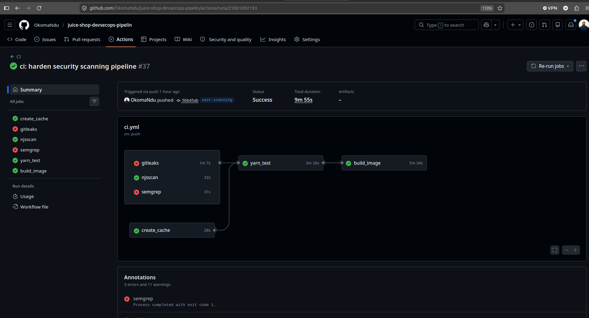
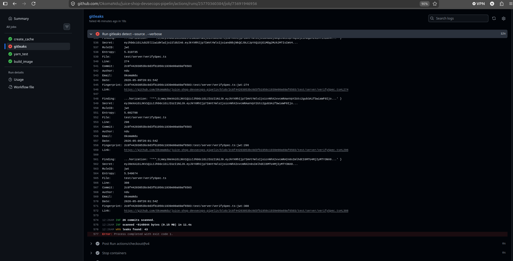
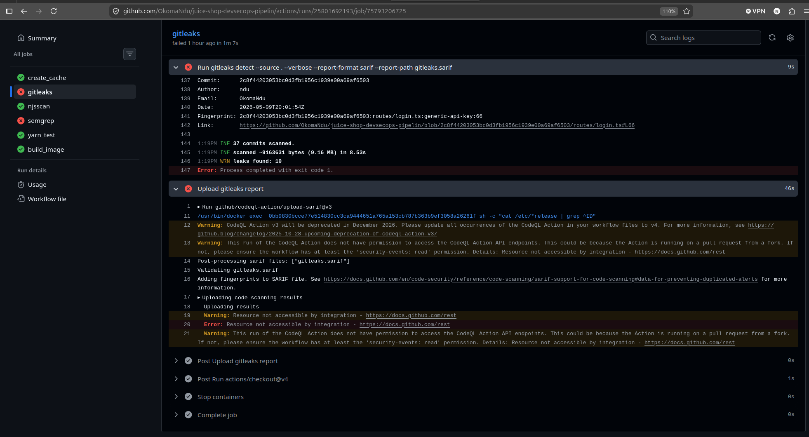
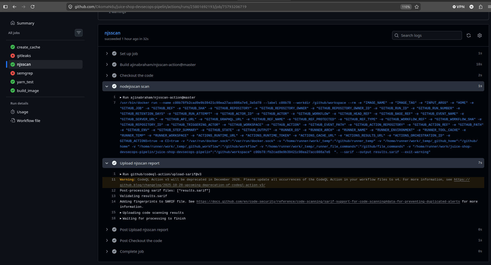
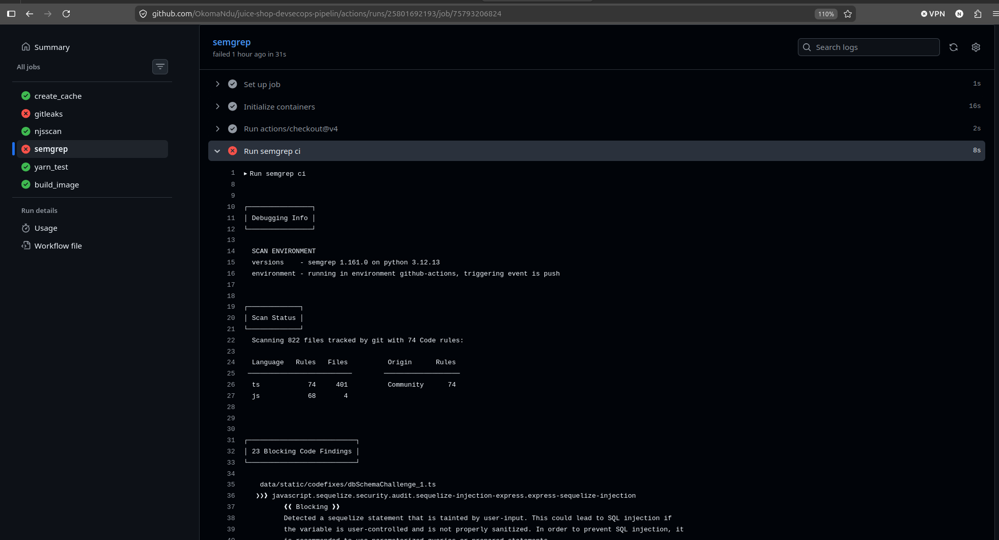
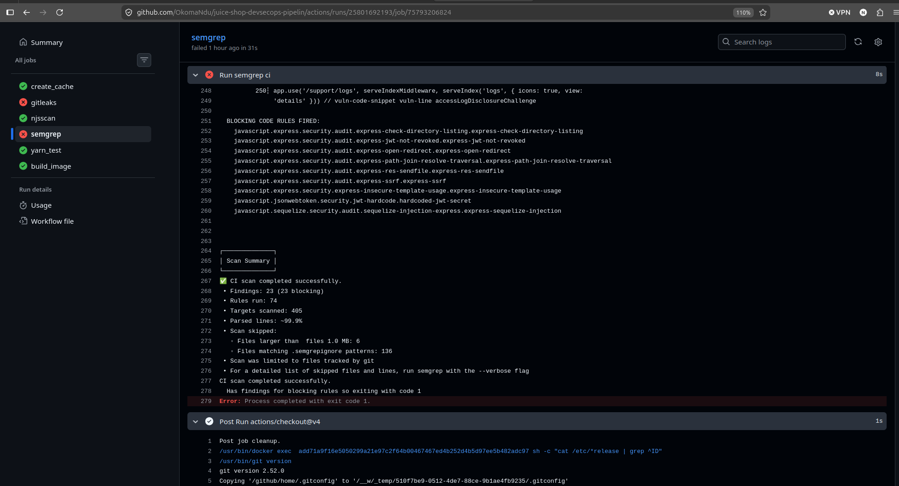

#  OWASP Juice Shop

[](https://owasp.org/projects/#sec-flagships)
[](https://github.com/juice-shop/juice-shop/releases/latest)
[](https://twitter.com/owasp_juiceshop)
[](https://reddit.com/r/owasp_juiceshop)


[](https://codeclimate.com/github/juice-shop/juice-shop/test_coverage)
[](https://codeclimate.com/github/juice-shop/juice-shop/maintainability)
[](https://codeclimate.com/github/juice-shop/juice-shop/trends/technical_debt)
[](https://dashboard.cypress.io/projects/3hrkhu/runs)
[](https://bestpractices.coreinfrastructure.org/projects/223)

[](CODE_OF_CONDUCT.md)

> [The most trustworthy online shop out there.](https://twitter.com/dschadow/status/706781693504589824)
> ([@dschadow](https://github.com/dschadow)) —
> [The best juice shop on the whole internet!](https://twitter.com/shehackspurple/status/907335357775085568)
> ([@shehackspurple](https://twitter.com/shehackspurple)) —
> [Actually the most bug-free vulnerable application in existence!](https://youtu.be/TXAztSpYpvE?t=26m35s)
> ([@vanderaj](https://twitter.com/vanderaj)) —
> [First you 😂😂then you 😢](https://twitter.com/kramse/status/1073168529405472768)
> ([@kramse](https://twitter.com/kramse)) —
> [But this doesn't have anything to do with juice.](https://twitter.com/coderPatros/status/1199268774626488320)
> ([@coderPatros' wife](https://twitter.com/coderPatros))

OWASP Juice Shop is probably the most modern and sophisticated insecure web application! It can be used in security
trainings, awareness demos, CTFs and as a guinea pig for security tools! Juice Shop encompasses vulnerabilities from the
entire
[OWASP Top Ten](https://owasp.org/www-project-top-ten) along with many other security flaws found in real-world
applications!


For a detailed introduction, full list of features and architecture overview please visit the official project page:
<https://owasp-juice.shop>

## Table of contents

- [CI Pipeline](#ci-pipeline)
    - [Pre-Commit Hook](#pre-commit-hook--local-secret-scanning)
- [Setup](#setup)
    - [From Sources](#from-sources)
    - [Packaged Distributions](#packaged-distributions)
    - [Docker Container](#docker-container)
    - [Vagrant](#vagrant)
    - [Amazon EC2 Instance](#amazon-ec2-instance)
    - [Azure Container Instance](#azure-container-instance)
    - [Google Compute Engine Instance](#google-compute-engine-instance)
    - [Heroku](#heroku)
    - [Gitpod](#gitpod)
- [Demo](#demo)
- [Documentation](#documentation)
    - [Node.js version compatibility](#nodejs-version-compatibility)
    - [Troubleshooting](#troubleshooting)
    - [Official companion guide](#official-companion-guide)
- [Contributing](#contributing)
- [References](#references)
- [Merchandise](#merchandise)
- [Donations](#donations)
- [Contributors](#contributors)
- [Licensing](#licensing)

## CI Pipeline

This project implements a **DevSecOps CI pipeline** using [GitHub Actions](https://github.com/features/actions), integrating automated security controls directly into the software delivery lifecycle. The pipeline is triggered on every `git push` and orchestrates six jobs across two execution stages:

- **Stage 1 — Parallel security scanning and test execution:** `create_cache`, `yarn_test`, `gitleaks`, `njsscan`, and `semgrep` run concurrently, maximising feedback speed.
- **Stage 2 — Gated image delivery:** `build_image` executes only after all Stage 1 jobs complete, ensuring no artefact is published without passing security validation and functional testing.

### Pipeline Architecture

```
git push
    │
    ├── create_cache    ← Installs and caches dependencies (node_modules / .yarn)
    │       │
    │   yarn_test       ← Restores cache and executes unit test suite
    │       │
    ├── gitleaks        ← Scans full git history for secrets; outputs SARIF (continue-on-error)
    ├── njsscan         ← Node.js SAST; uploads findings to GitHub Code Scanning via SARIF
    ├── semgrep         ← Multi-language SAST using p/javascript ruleset (continue-on-error)
    │       │
    └───────┴── build_image  ← Docker build & push to registry (needs: all above)
```



### Job Reference

| Job | Container / Action | Trigger Condition | Output |
|---|---|---|---|
| `create_cache` | `node:18-bullseye` | On every push | Cached `node_modules` / `.yarn` keyed to `yarn.lock` hash |
| `yarn_test` | `node:18-bullseye` | `needs: create_cache` | Test pass/fail result |
| `gitleaks` | `zricethezav/gitleaks:latest` | On every push (`continue-on-error: true`) | `gitleaks.sarif` uploaded to GitHub Security tab |
| `njsscan` | `ajinabraham/njsscan-action@master` | On every push | `results.sarif` uploaded to GitHub Code Scanning |
| `semgrep` | `semgrep/semgrep` | On every push (`continue-on-error: true`) | Blocking findings logged to GitHub Actions |
| `build_image` | `docker:24` (DinD) | `needs: [yarn_test, gitleaks, njsscan, semgrep]` | `ndubuisip/demo-app:juice-shop-1.2` pushed to Docker Hub |

---

### Stage 1 — Security Scanning

#### Secret Detection: Gitleaks

Gitleaks performs retrospective secret scanning across the full git history on every push, targeting hardcoded credentials including API keys, passwords, tokens, and private keys. The job is configured with `continue-on-error: true` to maintain pipeline continuity during active remediation, while ensuring findings remain fully visible to engineering teams.

**Scan command:**
```bash
gitleaks detect --source . --verbose --report-format sarif --report-path gitleaks.sarif
```

Findings are serialised to SARIF and uploaded to the **GitHub Security tab** via `github/codeql-action/upload-sarif@v3` using an `if: always()` condition, guaranteeing report upload regardless of whether the scan step exits with an error.

**Scan results — 37 commits scanned (~9.16 MB):**

| Rule ID | Affected Files |
|---|---|
| `generic-api-key` | `data/static/users.yml`, `routes/login.ts`, `test/api/*`, `frontend/src/app/*` |
| `jwt` | `test/server/verifySpec.ts`, `test/server/currentUserSpec.ts`, `test/cypress/integration/e2e/forgedJwt.spec.ts` |
| `private-key` | `lib/insecurity.ts` |

An initial scan identified **43 leaks**. After applying allowlist configuration (see below), findings were reduced to **10 verified production secrets**.



#### False Positive Suppression — `.gitleaks.toml`

The majority of initial findings originated from test fixtures (`test/`, `*.spec.ts`) containing intentional mock credentials — classified as false positives. A `.gitleaks.toml` configuration file was introduced at the repository root to apply an allowlist, scoping scans to production code only.

```toml
[extend]
useDefault = true

[allowlist]
paths = ['test', '.*\/test\/.*']
```

| Directive | Purpose |
|---|---|
| `useDefault = true` | Extends the built-in gitleaks ruleset without overriding default detection logic |
| `paths` allowlist | Excludes all files within `test/` directories from secret detection |

**Result:** 43 initial findings reduced to **10 verified leaks** across 37 commits (~9.16 MB), isolating genuine secrets in `lib/insecurity.ts` and `routes/login.ts` for targeted remediation.



---

#### SAST: njsscan

`njsscan` is a Node.js-specific static analysis tool that identifies insecure coding patterns, dangerous API usage, and known vulnerability signatures in JavaScript and TypeScript source code.

**CI job configuration:**
- Action: `ajinabraham/njsscan-action@master`
- Arguments: `. --sarif --output results.sarif --exit-warning`
- `--exit-warning` — exits non-zero on findings without causing a hard pipeline failure
- Requires `permissions: security-events: write` to publish SARIF results
- Findings are uploaded to **GitHub Security → Code Scanning** via `github/codeql-action/upload-sarif@v3`, providing a queryable, persistent record of vulnerabilities per commit



---

#### SAST: Semgrep

`semgrep` is an open-source, multi-language static analysis engine that applies community and custom rulesets to detect security anti-patterns, OWASP Top 10 vulnerabilities, and insecure configurations across JavaScript and TypeScript codebases.

**CI job configuration:**
- Container: `semgrep/semgrep`
- Ruleset: `SEMGREP_RULES: p/javascript` (community ruleset)
- Command: `semgrep ci`
- `continue-on-error: true` — pipeline proceeds to `build_image` regardless of findings, maintaining delivery velocity while findings are triaged

**Scan results — latest CI run:**

| Language | Rules Applied | Files Scanned | Ruleset Origin |
|---|---|---|---|
| TypeScript (`ts`) | 74 | 401 | Community |
| JavaScript (`js`) | 68 | 4 | Community |

Semgrep scanned **822 files** using **74 active rules** and reported **23 blocking findings**. Critical findings include SQL injection vulnerabilities in `data/static/codefixes/dbSchemaChallenge_1.ts`, flagged by the `javascript.sequelize.security.audit.sequelize-injection-express` rule — indicating user-controlled input passed directly to Sequelize ORM queries without parameterisation.





---

### Stage 2 — Pre-Commit Secret Scanning (Local Defence Layer)

To intercept secrets **before** they enter the git history, a git pre-commit hook executes gitleaks locally on every `git commit`. This represents the earliest possible enforcement point in the development workflow — upstream of the CI pipeline — where remediation is least costly.

#### Execution Flow

```
git commit
    │
    └── .git/hooks/pre-commit       ← executes automatically prior to commit recording
            │
            ├── Pull latest gitleaks image
            └── Run gitleaks detect --source="/path" --verbose
                    │
                    ├── Secrets detected  → exit code 1 — commit is blocked
                    └── No secrets found  → commit proceeds normally
```

#### Setup Instructions

**Step 1 — Create the hook file:**
```bash
vim .git/hooks/pre-commit
```

**Step 2 — Add the following script:**
```bash
docker pull zricethezav/gitleaks:latest
export path_to_host_folder_to_scan=/home/ndu/DevSecOps/juice-shop
docker run -v ${path_to_host_folder_to_scan}:/path zricethezav/gitleaks:latest detect --source="/path" --verbose
```

**Step 3 — Grant execute permission:**
```bash
chmod +x .git/hooks/pre-commit
```

#### Security Control Layering

| Control Layer | Enforcement Point | Blocks on Detection? |
|---|---|---|
| Pre-commit hook | Local — before `git commit` | Yes — exits with code 1 |
| CI `gitleaks` job | Remote — after `git push` | No — `continue-on-error: true` |

> **Operational Note:** `.git/hooks/` is not tracked by git and is not propagated via `git clone`. Each engineer must configure the hook independently on their local workstation.

---

### Security Architecture Summary

| Principle | Implementation |
|---|---|
| **Shift Left** | Pre-commit hook and parallel CI scans intercept vulnerabilities before code reaches production |
| **Defence in Depth** | Three independent security tools (`gitleaks`, `njsscan`, `semgrep`) cover distinct vulnerability classes |
| **Gated Delivery** | `build_image` is blocked until all scan and test jobs complete (`needs: [yarn_test, gitleaks, njsscan, semgrep]`) |
| **Audit Trail** | SARIF reports from `gitleaks` and `njsscan` are uploaded to GitHub Security, providing persistent per-commit vulnerability records |
| **Reproducibility** | All jobs execute in isolated, purpose-built containers, eliminating environment drift across pipeline runs |
| **Build Efficiency** | Dependency caching in `create_cache` keyed to `yarn.lock` eliminates redundant installs across downstream jobs |

---

## Setup

> You can find some less common installation variations in
> [the _Running OWASP Juice Shop_ documentation](https://pwning.owasp-juice.shop/part1/running.html).

### From Sources


1. Install [node.js](#nodejs-version-compatibility)
2. Run `git clone https://github.com/juice-shop/juice-shop.git --depth 1` (or
   clone [your own fork](https://github.com/juice-shop/juice-shop/fork)
   of the repository)
3. Go into the cloned folder with `cd juice-shop`
4. Run `npm install` (only has to be done before first start or when you change the source code)
5. Run `npm start`
6. Browse to <http://localhost:3000>

### Packaged Distributions

[](https://github.com/juice-shop/juice-shop/releases/latest)
[](https://sourceforge.net/projects/juice-shop/)
[](https://sourceforge.net/projects/juice-shop/)

1. Install a 64bit [node.js](#nodejs-version-compatibility) on your Windows, MacOS or Linux machine
2. Download `juice-shop-<version>_<node-version>_<os>_x64.zip` (or
   `.tgz`) attached to
   [latest release](https://github.com/juice-shop/juice-shop/releases/latest)
3. Unpack and `cd` into the unpacked folder
4. Run `npm start`
5. Browse to <http://localhost:3000>

> Each packaged distribution includes some binaries for `sqlite3` and
> `libxmljs` bound to the OS and node.js version which `npm install` was
> executed on.

### Docker Container

[](https://hub.docker.com/r/bkimminich/juice-shop)

[](https://microbadger.com/images/bkimminich/juice-shop
"Get your own image badge on microbadger.com")
[](https://microbadger.com/images/bkimminich/juice-shop
"Get your own version badge on microbadger.com")

1. Install [Docker](https://www.docker.com)
2. Run `docker pull bkimminich/juice-shop`
3. Run `docker run --rm -p 3000:3000 bkimminich/juice-shop`
4. Browse to <http://localhost:3000> (on macOS and Windows browse to
   <http://192.168.99.100:3000> if you are using docker-machine instead of the native docker installation)

### Vagrant

1. Install [Vagrant](https://www.vagrantup.com/downloads.html) and
   [Virtualbox](https://www.virtualbox.org/wiki/Downloads)
2. Run `git clone https://github.com/juice-shop/juice-shop.git` (or
   clone [your own fork](https://github.com/juice-shop/juice-shop/fork)
   of the repository)
3. Run `cd vagrant && vagrant up`
4. Browse to [192.168.56.110](http://192.168.56.110)

### Amazon EC2 Instance

1. In the _EC2_ sidenav select _Instances_ and click _Launch Instance_
2. In _Step 1: Choose an Amazon Machine Image (AMI)_ choose an _Amazon Linux AMI_ or _Amazon Linux 2 AMI_
3. In _Step 3: Configure Instance Details_ unfold _Advanced Details_ and copy the script below into _User Data_
4. In _Step 6: Configure Security Group_ add a _Rule_ that opens port 80 for HTTP
5. Launch your instance
6. Browse to your instance's public DNS

```
#!/bin/bash
yum update -y
yum install -y docker
service docker start
docker pull bkimminich/juice-shop
docker run -d -p 80:3000 bkimminich/juice-shop
```

### Azure Container Instance

1. Open and login (via `az login`) to your
   [Azure CLI](https://azure.github.io/projects/clis/) **or** login to the [Azure Portal](https://portal.azure.com),
   open the _CloudShell_
   and then choose _Bash_ (not PowerShell).
2. Create a resource group by running `az group create --name <group name> --location <location name, e.g. "centralus">`
3. Create a new container by
   running `az container create --resource-group <group name> --name <container name> --image bkimminich/juice-shop --dns-name-label <dns name label> --ports 3000 --ip-address public`
4. Your container will be available at `http://<dns name label>.<location name>.azurecontainer.io:3000`

### Google Compute Engine Instance

1. Login to the Google Cloud Console and
   [open Cloud Shell](https://console.cloud.google.com/home/dashboard?cloudshell=true).
2. Launch a new GCE instance based on the juice-shop container. Take note of the `EXTERNAL_IP` provided in the output.

```
gcloud compute instances create-with-container owasp-juice-shop-app --container-image bkimminich/juice-shop
```

3. Create a firewall rule that allows inbound traffic to port 3000

```
gcloud compute firewall-rules create juice-rule --allow tcp:3000
```

4. Your container is now running and available at
   `http://<EXTERNAL_IP>:3000/`

### Heroku

1. [Sign up to Heroku](https://signup.heroku.com/) and
   [log in to your account](https://id.heroku.com/login)
2. Click the button below and follow the instructions

[](https://heroku.com/deploy)

If you have forked the Juice Shop repository on GitHub, the _Deploy to
Heroku_ button will deploy your forked version of the application.

### Gitpod 

1. Login to [gitpod.io](https://gitpod.io) and use <https://gitpod.io/#https://github.com/juice-shop/juice-shop/> to start a new workspace. If you want to spin up a forked repository, your URL needs to be adjusted accordingly.

2. After the Gitpod workspace is loaded, Gitpod tasks is still running to install `npm install`  and launch the website. Despite Gitpod showing your workspace state already as _Running_, you need to wait until the installation process is done, before the website becomes accessable. The _Open Preview Window (Internal Browser)_, will open automatically and refresh itself automatically when the server has started.

3. Your Juice Shop instance is now also available at `https://3000-<GITPOD_WORKSPACE_ID>.<GITPOD_HOSTING_ZONE>.gitpod.io`.

## Demo

Feel free to have a look at the latest version of OWASP Juice Shop:
<http://demo.owasp-juice.shop>

> This is a deployment-test and sneak-peek instance only! You are __not
> supposed__ to use this instance for your own hacking endeavours! No
> guaranteed uptime! Guaranteed stern looks if you break it!

## Documentation

### Node.js version compatibility


OWASP Juice Shop officially supports the following versions of
[node.js](http://nodejs.org) in line with the official
[node.js LTS schedule](https://github.com/nodejs/LTS) as close as possible. Docker images and packaged distributions are
offered accordingly.

| node.js | Supported            | Tested             | [Packaged Distributions](#packaged-distributions) | [Docker images](#docker-container) from `master` | [Docker images](#docker-container) from `develop` |
|:--------|:---------------------|:-------------------|:--------------------------------------------------|:-------------------------------------------------|:--------------------------------------------------|
| 20.x    | :x:                  | :x:                |                                                   |                                                  |                                                   |
| 19.x    | (:heavy_check_mark:) | :heavy_check_mark: |                                                   |                                                  |                                                   |
| 18.x    | :heavy_check_mark:   | :heavy_check_mark: | Windows (`x64`), MacOS (`x64`), Linux (`x64`)     | `latest` (`linux/amd64`, `linux/arm64`)          | `snapshot` (`linux/amd64`, `linux/arm64`)         |
| 17.x    | (:heavy_check_mark:) | :x:                |                                                   |                                                  |                                                   |
| 16.x    | :heavy_check_mark:   | :heavy_check_mark: | Windows (`x64`), MacOS (`x64`), Linux (`x64`)     |                                                  |                                                   |
| 15.x    | (:heavy_check_mark:) | :x:                |                                                   |                                                  |                                                   |
| 14.x    | :heavy_check_mark:   | :heavy_check_mark: | Windows (`x64`), MacOS (`x64`), Linux (`x64`)     |                                                  | `                                                 |
| <14.x   | :x:                  | :x:                |                                                   |                                                  |                                                   |

Juice Shop is automatically tested _only on the latest `.x` minor version_ of each node.js version mentioned above!
There is no guarantee that older minor node.js releases will always work with Juice Shop!
Please make sure you stay up to date with your chosen version.

### Troubleshooting

[](https://gitter.im/bkimminich/juice-shop)

If you need help with the application setup please check our
[our existing _Troubleshooting_](https://pwning.owasp-juice.shop/appendix/troubleshooting.html)
guide. If this does not solve your issue please post your specific problem or question in the
[Gitter Chat](https://gitter.im/bkimminich/juice-shop) where community members can best try to help you.

:stop_sign: **Please avoid opening GitHub issues for support requests or questions!**

### Official companion guide

[](https://www.goodreads.com/review/edit/49557240)

OWASP Juice Shop comes with an official companion guide eBook. It will give you a complete overview of all
vulnerabilities found in the application including hints how to spot and exploit them. In the appendix you will even
find complete step-by-step solutions to every challenge. Extensive documentation of
[custom re-branding](https://pwning.owasp-juice.shop/part1/customization.html),
[CTF-support](https://pwning.owasp-juice.shop/part1/ctf.html),
[trainer's guide](https://pwning.owasp-juice.shop/appendix/trainers.html)
and much more is also included.

[Pwning OWASP Juice Shop](https://leanpub.com/juice-shop) is published under
[CC BY-NC-ND 4.0](https://creativecommons.org/licenses/by-nc-nd/4.0/)
and is available **for free** in PDF, Kindle and ePub format on LeanPub. You can also
[browse the full content online](https://pwning.owasp-juice.shop)!

[](https://leanpub.com/juice-shop)

## Contributing

[](https://github.com/bkimminich/juice-shop/graphs/contributors)
[](http://standardjs.com/)
[](https://crowdin.com/project/owasp-juice-shop)


We are always happy to get new contributors on board! Please check
[CONTRIBUTING.md](CONTRIBUTING.md) to learn how to
[contribute to our codebase](CONTRIBUTING.md#code-contributions) or the
[translation into different languages](CONTRIBUTING.md#i18n-contributions)!

## References

Did you write a blog post, magazine article or do a podcast about or mentioning OWASP Juice Shop? Or maybe you held or
joined a conference talk or meetup session, a hacking workshop or public training where this project was mentioned?

Add it to our ever-growing list of [REFERENCES.md](REFERENCES.md) by forking and opening a Pull Request!

## Merchandise

* On [Spreadshirt.com](http://shop.spreadshirt.com/juiceshop) and
  [Spreadshirt.de](http://shop.spreadshirt.de/juiceshop) you can get some swag (Shirts, Hoodies, Mugs) with the official
  OWASP Juice Shop logo
* On
  [StickerYou.com](https://www.stickeryou.com/products/owasp-juice-shop/794)
  you can get variants of the OWASP Juice Shop logo as single stickers to decorate your laptop with. They can also print
  magnets, iron-ons, sticker sheets and temporary tattoos.

The most honorable way to get some stickers is to
[contribute to the project](https://pwning.owasp-juice.shop/part3/contribution.html)
by fixing an issue, finding a serious bug or submitting a good idea for a new challenge!

We're also happy to supply you with stickers if you organize a meetup or conference talk where you use or talk about or
hack the OWASP Juice Shop! Just
[contact the mailing list](mailto:owasp_juice_shop_project@lists.owasp.org)
or [the project leader](mailto:bjoern.kimminich@owasp.org) to discuss your plans!

## Donations

[](https://owasp.org/donate/?reponame=www-project-juice-shop&title=OWASP+Juice+Shop)

The OWASP Foundation gratefully accepts donations via Stripe. Projects such as Juice Shop can then request reimbursement
for expenses from the Foundation. If you'd like to express your support of the Juice Shop project, please make sure to
tick the "Publicly list me as a supporter of OWASP Juice Shop" checkbox on the donation form. You can find our more
about donations and how they are used here:

<https://pwning.owasp-juice.shop/part3/donations.html>

## Contributors

The OWASP Juice Shop core project team are:

- [Björn Kimminich](https://github.com/bkimminich) aka `bkimminich`
  ([Project Leader](https://www.owasp.org/index.php/Projects/Project_Leader_Responsibilities))
  [](https://keybase.io/bkimminich)
- [Jannik Hollenbach](https://github.com/J12934) aka `J12934`
- [Timo Pagel](https://github.com/wurstbrot) aka `wurstbrot`
- [Shubham Palriwala](https://github.com/ShubhamPalriwala) aka `ShubhamPalriwala`

For a list of all contributors to the OWASP Juice Shop please visit our
[HALL_OF_FAME.md](HALL_OF_FAME.md).

## Licensing

[](LICENSE)

This program is free software: you can redistribute it and/or modify it under the terms of the [MIT license](LICENSE).
OWASP Juice Shop and any contributions are Copyright © by Bjoern Kimminich & the OWASP Juice Shop contributors
2014-2023.


