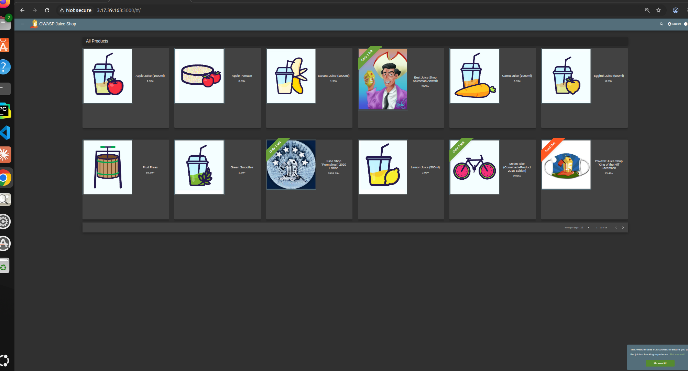
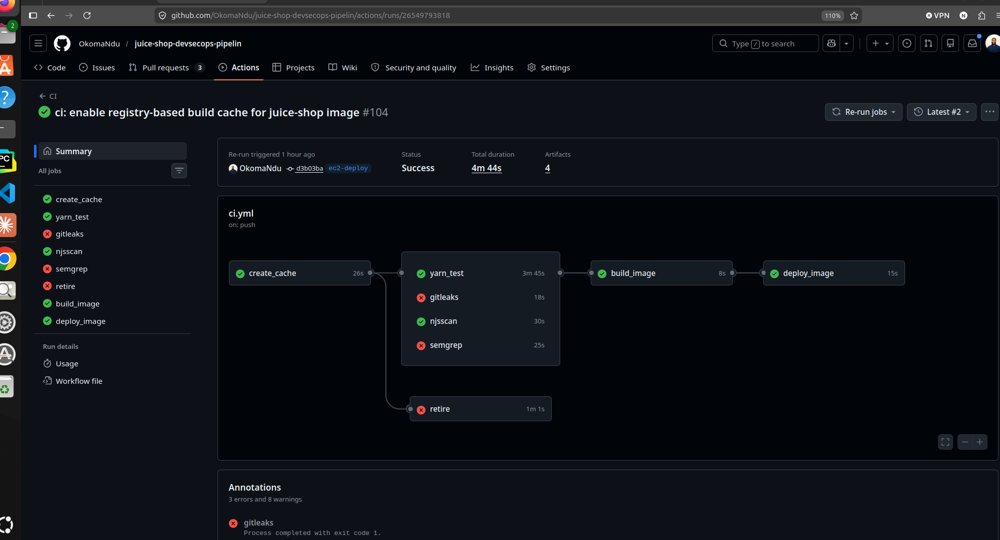
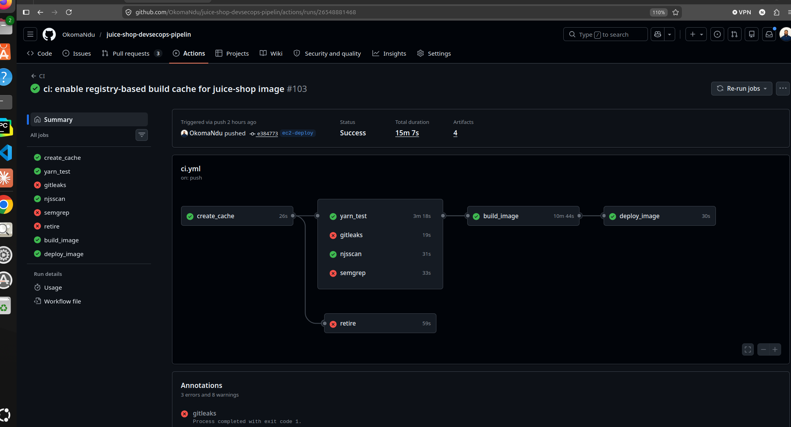
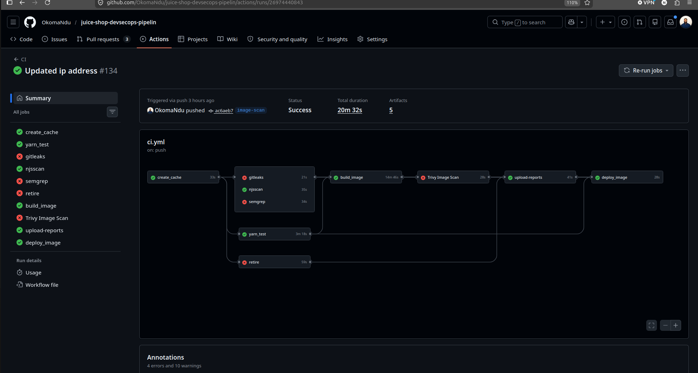
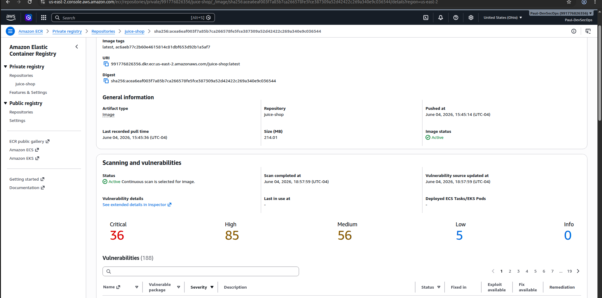
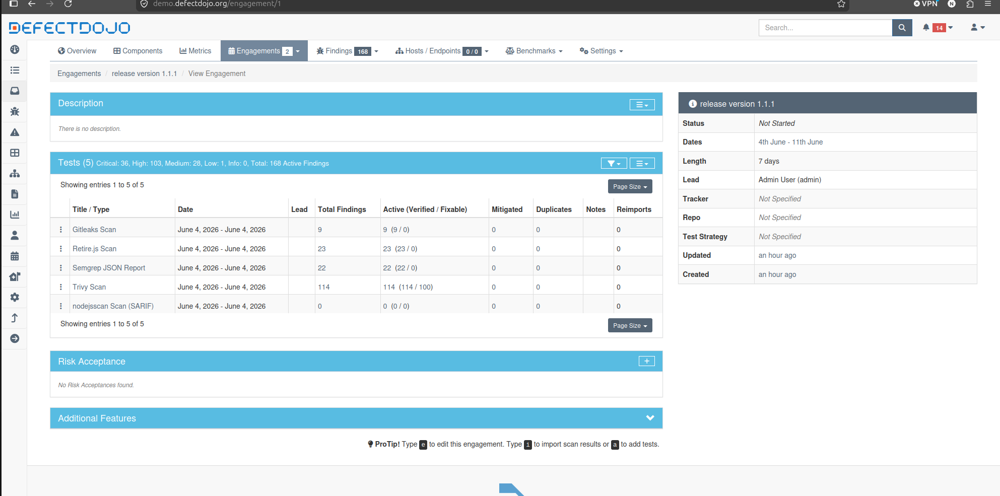
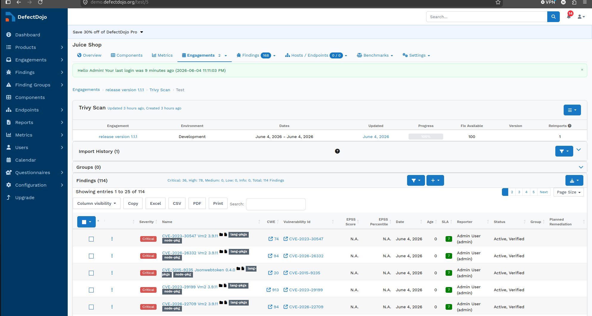
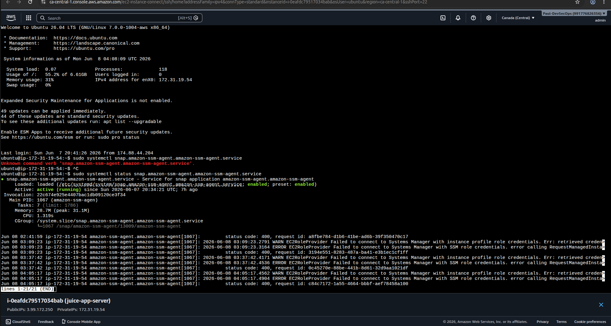
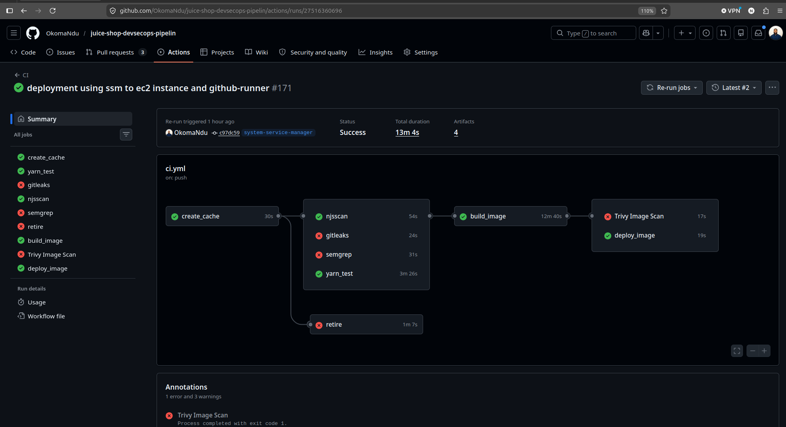
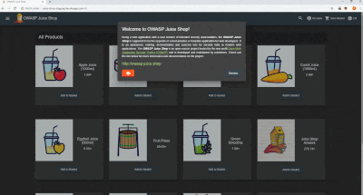

<h1 align="center">Juice Shop &mdash; DevSecOps CI/CD Pipeline</h1>

<p align="center">
  <em>An end-to-end, production-style CI/CD pipeline that builds, security-scans, and ships
  the OWASP Juice Shop vulnerable application from GitHub to a live AWS EC2 instance on every commit.</em>
</p>

<p align="center">
  
  
  
  
  
  <br>
  
  
  
  
  
</p>

---

## Overview

This repository delivers a fully automated DevSecOps pipeline for the
[OWASP Juice Shop](https://owasp.org/www-project-juice-shop/) application.
Every push to GitHub triggers a **9-stage workflow** that runs unit tests,
executes **six integrated security gates** (secrets, two SAST engines,
software-composition analysis, container image scanning, and AWS-native
registry scanning), builds a hardened Docker image on a self-hosted runner,
publishes it to a private Amazon ECR registry, and performs a zero-touch
**keyless deployment to a target EC2 instance via AWS Systems Manager**
&mdash; with the application host's SSH port permanently closed to the
public internet.

The pipeline is engineered around four production-grade concerns:

- **Shift-left security** &mdash; six scanners cover the full
  build-to-runtime spectrum: source (`gitleaks`, `njsscan`, `semgrep`),
  dependencies (`retire.js`), container image (`Trivy`), and the
  registry itself (Amazon ECR Enhanced Scanning powered by Inspector).
  Scan reports are also wired for one-shot import into a central
  **DefectDojo** engagement via [`upload-report.py`](upload-report.py)
  for human triage and SLA tracking.
- **Zero-trust operations, zero static credentials** &mdash; the
  production EC2 host runs with **port 22 closed**. Deployments and
  break-glass shell access both go through **AWS Systems Manager
  Session Manager**, authenticated by IAM role instead of static SSH
  keys. *Both* the application host and the self-hosted runner carry
  EC2 instance profiles (`app-server-role` and `github-runner-role`),
  so the pipeline itself holds **no `AWS_ACCESS_KEY_ID`,
  `AWS_SECRET_ACCESS_KEY`, or `.pem` file** in either GitHub Actions
  secrets or the workflow `env:`. All AWS auth is delegated to the
  EC2 metadata service.
- **Speed** &mdash; registry-based Docker layer caching, a shared `yarn`
  cache, and a self-hosted runner cut the `build_image` stage from
  **10&nbsp;m&nbsp;44&nbsp;s → 8&nbsp;s** between runs (≈&nbsp;99 % faster
  re-builds when no source change invalidates the layer cache).
- **Reproducibility** &mdash; every image is dual-tagged with its commit
  SHA and `:latest`, giving an auditable, rollback-ready history in ECR
  and on the self-hosted runner.

## Architecture

```text
   ┌──────────────┐       ┌──────────────────────────────────────────────────────┐
   │  Developer   │       │               GitHub Actions (9 jobs)                │
   │   git push   │──────►│                                                      │
   └──────────────┘       │  create_cache ──► yarn_test                          │
                          │              │──► gitleaks   (secrets)               │
                          │              │──► njsscan    (SAST → SARIF)          │
                          │              │──► semgrep    (SAST)                  │
                          │              │──► retire     (SCA)                   │
                          │              ▼                                       │
                          │      ┌────────────────────────────────────────────┐  │
                          │      │  build_image  +  deploy_image              │  │
                          │      │  ─────────────────────────────────         │  │
                          │      │  runs-on: [self-hosted, juice-shop]        │  │
                          │      │                                            │  │
                          │      │       ┌────────────────────────────┐       │  │
                          │      │       │  self-hosted-runner (EC2)  │       │  │
                          │      │       │  IAM role: github-runner-  │       │  │
                          │      │       │           role             │       │  │
                          │      │       │    ├─ AmazonEC2Container-  │       │  │
                          │      │       │    │  RegistryFullAccess   │       │  │
                          │      │       │    └─ AmazonSSMFullAccess  │       │  │
                          │      │       └─────┬──────────────┬───────┘       │  │
                          │      └─────────────┼──────────────┼───────────────┘  │
                          │                    │              │                  │
                          │       docker push  │              │  aws ssm         │
                          │       :sha+:latest │              │  send-command    │
                          │                    ▼              │                  │
                          │      ┌─────────────────────┐      │ ┌──────────────┐ │
                          │      │ Amazon ECR (priv.)  │◄────►│ │ ECR Enhanced │ │
                          │      │ juice-shop repo     │      │ │ Scanning     │ │
                          │      └─────────┬───────────┘      │ │ (Inspector)  │ │
                          │                │                  │ └──────────────┘ │
                          │                ▼                  │                  │
                          │      ┌─────────────────────┐      │                  │
                          │      │  trivy image scan   │      │                  │
                          │      └─────────────────────┘      │                  │
                          └─────────────────────────────────-─┼──────────────────┘
                                                              ▼
                                ┌──────────────────────────────────────┐
                                │           juice-app-server           │
                                │     Ubuntu 26.04 / EC2 t2.micro      │
                                │  IAM role: app-server-role           │
                                │    ├─ AmazonSSMManagedInstanceCore   │
                                │    └─ AmazonEC2ContainerRegistryFull │
                                │                                      │
                                │  amazon-ssm-agent  ──►  docker pull  │
                                │                         docker run   │
                                │                            :3000 ───►│ browser
                                └──────────────────────────────────────┘
```

## At a Glance

| Capability                  | Implementation                                                                                                          |
|-----------------------------|-------------------------------------------------------------------------------------------------------------------------|
| **Pipeline orchestration**  | GitHub Actions, 9 jobs, fan-out / fan-in DAG, dual `ubuntu-latest` + self-hosted runner topology                        |
| **Secrets scanning**        | `gitleaks` against full git history (`fetch-depth: 0`)                                                                  |
| **SAST**                    | `njsscan` (Node-specific, SARIF → GitHub Code Scanning) + `semgrep` (`p/javascript` ruleset)                            |
| **Dependency scanning**     | `retire.js` against `node_modules`                                                                                      |
| **Container image scanning**| `Trivy` against the freshly pushed ECR image, gated on HIGH / CRITICAL severities                                       |
| **Registry-side scanning**  | Amazon ECR **Enhanced Scanning** (Amazon Inspector) &mdash; continuous, OS-package + language-package CVE coverage      |
| **Vulnerability management**| Scan reports normalised for **DefectDojo** import via [`upload-report.py`](upload-report.py) (Gitleaks / SARIF / Semgrep / Retire.js / Trivy) for triage and SLA tracking |
| **Vulnerability remediation**| Hands-on CVE fix: upgraded `express-jwt` `0.1.3 → 6.0.0` to break the vulnerable transitive `jsonwebtoken` chain (CVE-2015-9235) |
| **Image hardening**         | Multi-stage Dockerfile, non-root user (`USER 65532`), slim runtime base (`node:18-bookworm-slim`), final image ≈ 214 MB |
| **Test execution**          | `yarn test` (Juice Shop unit suite) gated before image build                                                            |
| **Image registry**          | Private Amazon ECR repository, dual-tagged `:${{ github.sha }}` + `:latest`                                             |
| **Caching strategy**        | (1) `actions/cache` for `node_modules` / `.yarn` keyed on `yarn.lock`, (2) registry-based Docker BuildKit               |
| **Deployment transport**    | **AWS Systems Manager Session Manager** (`aws ssm send-command`) &mdash; no SSH, no port 22, no static keys             |
| **App-host identity**       | EC2 instance profile `app-server-role` &mdash; `AmazonSSMManagedInstanceCore` + `AmazonEC2ContainerRegistryFullAccess`  |
| **CI-runner identity**      | EC2 instance profile `github-runner-role` &mdash; `AmazonEC2ContainerRegistryFullAccess` + `AmazonSSMFullAccess`        |
| **Infrastructure**          | 2 × Ubuntu 26.04 EC2 instances (app + self-hosted runner), least-privilege Security Groups (app host has **no inbound 22**) |
| **Secrets management**      | The pipeline holds **no static AWS credentials** &mdash; both `AWS_ACCESS_KEY_ID` and `AWS_SECRET_ACCESS_KEY` are removed from GitHub Actions secrets; only the DefectDojo API key remains |

## Live Deployment

Once the pipeline succeeds, the application is served from a containerised
distroless Node.js image on a dedicated EC2 instance:

> :globe_with_meridians: **`http://18.118.27.38:3000/`**



## Repository Layout

```text
.
├── .github/workflows/ci.yml      ← 8-stage CI/CD pipeline definition
├── Dockerfile                    ← Multi-stage build, distroless runtime
├── screenshots/                  ← Pipeline run + deployment evidence
├── frontend/                     ← Juice Shop Angular UI (upstream)
├── routes/, models/, lib/        ← Juice Shop Node.js backend (upstream)
└── README.md                     ← Project documentation (this file)
```

## Table of Contents

**DevSecOps Pipeline**

- [CI Pipeline](#ci-pipeline)
  - [Pipeline Jobs](#pipeline-jobs)
  - [Building and Pushing the Image to AWS ECR](#building-and-pushing-the-image-to-aws-ecr)
- [Image Security & Vulnerability Management](#image-security--vulnerability-management)
  - [Trivy &mdash; CI-side Container Image Scanning](#trivy--ci-side-container-image-scanning)
  - [Amazon ECR Enhanced Scanning (Inspector)](#amazon-ecr-enhanced-scanning-inspector)
  - [Centralised Triage in DefectDojo](#centralised-triage-in-defectdojo)
  - [Case Study &mdash; Remediating CVE-2015-9235 (`jsonwebtoken`)](#case-study--remediating-cve-2015-9235-jsonwebtoken)
  - [Base Image Hardening &mdash; `distroless` → `node:18-bookworm-slim`](#base-image-hardening--distroless--node18-bookworm-slim)
- [Secure Continuous Deployment via AWS Systems Manager](#secure-continuous-deployment-via-aws-systems-manager)
  - [Why SSM Instead of SSH](#why-ssm-instead-of-ssh)
  - [Verifying the SSM Agent](#verifying-the-ssm-agent)
  - [Two Instance Profiles, Zero Static Credentials in CI](#two-instance-profiles-zero-static-credentials-in-ci)
  - [The `app-server-role` IAM Role (App-Host Side)](#the-app-server-role-iam-role-app-host-side)
  - [The `github-runner-role` IAM Role (CI-Runner Side)](#the-github-runner-role-iam-role-ci-runner-side)
  - [Attaching the Roles to the EC2 Instances](#attaching-the-roles-to-the-ec2-instances)
  - [Connecting to the Host via Session Manager](#connecting-to-the-host-via-session-manager)
  - [The `deploy_image` Job &mdash; `aws ssm send-command`](#the-deploy_image-job--aws-ssm-send-command)
- [Release Deployment](#release-deployment)
  - [Provisioning the Application EC2 Instance (`juice-app-server`)](#provisioning-the-application-ec2-instance-juice-app-server)
  - [Installing Docker and the AWS CLI](#installing-docker-and-the-aws-cli)
  - [Authenticating to Amazon ECR](#authenticating-to-amazon-ecr)
  - [Verifying the Deployed Container](#verifying-the-deployed-container)
- [Self-Hosted GitHub Actions Runner](#self-hosted-github-actions-runner)
  - [Provisioning the Runner EC2 Instance (`self-hosted-runner`)](#provisioning-the-runner-ec2-instance-self-hosted-runner)
  - [Registering the Runner with GitHub](#registering-the-runner-with-github)
  - [Installing Build Tooling on the Runner](#installing-build-tooling-on-the-runner)
  - [Running the Runner as a Service](#running-the-runner-as-a-service)
  - [Runner Image Cache & Disk Hygiene](#runner-image-cache--disk-hygiene)

**About the Application Under Test**

- [OWASP Juice Shop](#owasp-juice-shop)
- [Setup](#setup) · [Demo](#demo) · [Documentation](#documentation)
- [Contributing](#contributing) · [References](#references) · [Licensing](#licensing)

---

## CI Pipeline

The pipeline is defined in
[`.github/workflows/ci.yml`](.github/workflows/ci.yml) and triggers on
every `push`. It is organised as a fan-out of independent quality and
security gates after a shared dependency-cache stage, followed by a
sequential build-and-release fan-in:

```text
                 ┌─► yarn_test ─┐                       ┌─► trivy           (post-build scan)
                 ├─► gitleaks ──┤                       │
 create_cache ──►┼─► njsscan ───┼──► build_image ──────►┤
                 ├─► semgrep ───┤                       │
                 └─► retire ────┘                       └─► deploy_image    (via AWS SSM)
```

### Pipeline Jobs

Each job runs in its own container (or on the self-hosted runner for
`build_image`) so failures are isolated and tool versions are pinned.

| Job             | Runner                                   | Purpose                                                                                                              | Failure policy                                       |
|-----------------|------------------------------------------|----------------------------------------------------------------------------------------------------------------------|------------------------------------------------------|
| `create_cache`  | `ubuntu-latest` (`node:18-bullseye`)     | Restores or hydrates the `node_modules` + `.yarn` cache keyed by `yarn.lock` so downstream jobs skip a full install. | Blocks pipeline on failure                           |
| `yarn_test`     | `ubuntu-latest` (`node:18-bullseye`)     | Installs deps (cache hit) and runs `yarn test` &mdash; the Juice Shop unit suite.                                    | Blocks `build_image`                                 |
| `gitleaks`      | `ubuntu-latest` (`zricethezav/gitleaks`) | Scans the full git history (`fetch-depth: 0`) for committed secrets; uploads `gitleaks.json` artifact.               | `continue-on-error: true` &mdash; reported, non-blocking |
| `njsscan`       | `ubuntu-latest`                          | Node.js-specific SAST via `ajinabraham/njsscan-action`; uploads SARIF to GitHub code scanning and as an artifact.    | Blocks `build_image` on warnings                     |
| `semgrep`       | `ubuntu-latest` (`semgrep/semgrep`)      | Generic SAST using the `p/javascript` ruleset; uploads `semgrep.json`.                                               | `continue-on-error: true`                            |
| `retire`        | `ubuntu-latest` (`node:18-bullseye`)     | `retire.js` scan for known-vulnerable JavaScript dependencies; uploads `retire.json`.                                | `continue-on-error: true`                            |
| `build_image`   | `self-hosted, juice-shop`                | Builds the Docker image and pushes both `:${{ github.sha }}` and `:latest` to ECR.                                   | Blocks `trivy` & `deploy_image`                      |
| `trivy`         | `ubuntu-latest` (`aquasec/trivy`)        | Pulls the freshly pushed image from ECR and scans for HIGH / CRITICAL CVEs; uploads `trivy.json` artifact.           | `continue-on-error: true` &mdash; reported, non-blocking |
| `deploy_image`  | `self-hosted, juice-shop`                | Issues `aws ssm send-command` against the app-server instance ID to pull the new image and recreate the container &mdash; **no SSH**. | Final stage                                          |

The recent successful runs
([`#103`](https://github.com/OkomaNdu/juice-shop-devsecops-pipelin/actions/runs/26548881468),
[`#104`](https://github.com/OkomaNdu/juice-shop-devsecops-pipelin/actions/runs/26549793818))
show the expected steady-state behaviour: `gitleaks`, `semgrep`, and
`retire` report findings (visible in the Annotations panel) but
`continue-on-error: true` keeps them from blocking the release, while
`yarn_test` and `njsscan` must pass for `build_image` to start.



The re-run (`#104`) demonstrates the value of the registry-based build
cache enabled in commit `d3b03ba` &mdash; total duration drops from
**15&nbsp;m&nbsp;7&nbsp;s → 4&nbsp;m&nbsp;44&nbsp;s**, with `build_image`
falling from `10m 44s` to `8s` because every Docker layer hits cache:



#### Caching Strategy

`create_cache` exists so the downstream Node.js jobs (`yarn_test`,
`retire`, and any future Node-based gate) share a single hydrated
`node_modules` / `.yarn` directory keyed by `hashFiles('yarn.lock')`.
The cache key rolls automatically whenever `yarn.lock` changes, and the
`if: steps.cache-restore.outputs.cache-hit != 'true'` guard ensures the
`yarn install` only runs on a real miss.

#### Scan Reports as Artifacts

Every security gate uploads its raw report as a workflow artifact
(`gitleaks-report`, `njsscan.sarif`, `semgrep.json`, `retire.json`,
`trivy.json`). The companion script
[`upload-report.py`](upload-report.py) normalises each format and
imports it into DefectDojo through its REST API; it can be wired
into the workflow as a follow-up job whenever the
`DEFECTDOJO_API_KEY` secret is provisioned, or invoked manually
against the downloaded artifacts.

### Building and Pushing the Image to AWS ECR

`build_image` runs on the
[self-hosted runner](#self-hosted-github-actions-runner) because the
Juice Shop Docker build is heavier than what GitHub-hosted runners can
comfortably accommodate. The steps:

1. Check out the source.
2. Resolve the ECR image name from the `AWS_ACCOUNT_ID` and
   `AWS_DEFAULT_REGION` repository variables:
   `${AWS_ACCOUNT_ID}.dkr.ecr.${AWS_DEFAULT_REGION}.amazonaws.com/juice-shop`.
3. Authenticate Docker to ECR via
   `aws ecr get-login-password | docker login --username AWS --password-stdin …`.
4. Build the image tagged with both the commit SHA (immutable,
   auditable) and `latest` (the tag the application host pulls).
5. Push both tags to ECR.

The SHA tag pins a known-good build for rollback; `:latest` is the
moving pointer the `deploy_image` stage consumes.

The deployment stage and the bootstrap of the application host are
documented in [Release Deployment](#release-deployment) below.

---

## Image Security & Vulnerability Management

Source-code scanning catches issues *before* the build; this section
covers what catches issues *after* the build &mdash; in the container
image, the registry, and across the long tail of transitive
dependencies. The pipeline integrates three independent layers of image
security and routes every finding into a single triage view in
DefectDojo.

| Layer            | Scanner                       | Where it runs                  | What it catches                                          |
|------------------|-------------------------------|--------------------------------|----------------------------------------------------------|
| CI image scan    | **Trivy**                     | GitHub Actions, post-`build_image` | OS package CVEs + language package CVEs in the freshly pushed image |
| Registry scan    | **Amazon ECR Enhanced Scanning** (Inspector) | Continuous, AWS-managed | Same coverage as Trivy, but re-runs automatically whenever the CVE database changes &mdash; without re-running the pipeline |
| Triage / SLA     | **DefectDojo**                | Hosted demo instance           | De-duplication, severity-based SLA tracking, risk-acceptance workflow, single pane of glass for all five scanners |



> :information_source: The screenshot above shows pipeline run **#134**
> &mdash; the post-Trivy / post-DefectDojo topology. End-to-end duration
> is now 20&nbsp;m&nbsp;32&nbsp;s with the additional scan and upload
> stages; the deploy-image hot path itself remains a few seconds
> because of the registry-based build cache.

### Trivy &mdash; CI-side Container Image Scanning

The `trivy` job runs immediately after `build_image` so that the
*exact bytes* that were just pushed to ECR are scanned, not a local
rebuild:

```yaml
trivy:
  name: Trivy Image Scan
  runs-on: ubuntu-latest
  continue-on-error: true
  needs: build_image
  container:
    image: aquasec/trivy:latest
    options: --entrypoint ""
  steps:
    - run: apk --no-cache add aws-cli
    - name: Log in to ECR
      run: |
        aws ecr get-login-password --region $AWS_DEFAULT_REGION | \
        trivy registry login \
          --username AWS --password-stdin \
          $AWS_ACCOUNT_ID.dkr.ecr.$AWS_DEFAULT_REGION.amazonaws.com
    - name: Run Trivy scan
      run: |
        trivy image \
          --severity HIGH,CRITICAL \
          --exit-code 1 \
          -f json -o trivy.json \
          $IMAGE_NAME:${{ github.sha }}
    - name: Upload Trivy report
      if: always()
      uses: actions/upload-artifact@v4
      with:
        name: trivy.json
        path: trivy.json
```

Design notes:

- **Scan the SHA-tagged image, not `:latest`.** The SHA tag is
  immutable; `:latest` could move between push and scan in a high-
  throughput repo.
- **Trivy authenticates to ECR through its native `trivy registry
  login`** &mdash; no need to docker-pull the image first, which would
  burn runner disk and bandwidth.
- **`--exit-code 1` flips the job red** on any HIGH/CRITICAL finding,
  while `continue-on-error: true` keeps the pipeline moving so the
  finding still flows into DefectDojo for human triage. This is the
  *report-now-fail-later* posture appropriate for a long-lived
  vulnerable application; it would be inverted to *fail-fast* on a
  production codebase.

### Amazon ECR Enhanced Scanning (Inspector)

Trivy gives a **point-in-time** snapshot at build time. To catch
CVEs that are disclosed *after* an image is pushed, the
`juice-shop` ECR repository has **Enhanced Scanning** turned on,
which delegates the scan to Amazon Inspector. Inspector then keeps
re-evaluating every image in the repo against its evolving CVE
database with no pipeline involvement.

A typical Inspector result page for a juice-shop image looks like
this:



The combination is deliberate:

- **Trivy** is a *gate* &mdash; it fires on every build and feeds the
  developer feedback loop.
- **ECR Enhanced Scanning** is a *watchtower* &mdash; it monitors
  in-registry images continuously, so a CVE disclosed at 03:00 UTC
  shows up on the next on-call dashboard refresh even if nobody has
  pushed code in weeks.

### Centralised Triage in DefectDojo

Five scanners producing five different JSON / SARIF formats is
unmanageable without aggregation. The companion helper
[`upload-report.py`](upload-report.py) normalises every report and
POSTs it into a single DefectDojo engagement via the platform's
REST API. It can be invoked as a follow-up workflow job, run from
a maintainer's workstation against the downloaded artifacts, or
scheduled out-of-band on a cadence:

```python
# upload-report.py (excerpt)
if   file_name == 'gitleaks.json':  scan_type = 'Gitleaks Scan'
elif file_name == 'njsscan.sarif':  scan_type = 'SARIF'
elif file_name == 'semgrep.json':   scan_type = 'Semgrep JSON Report'
elif file_name == 'retire.json':    scan_type = 'Retire.js Scan'
elif file_name == 'trivy.json':     scan_type = 'Trivy Scan'

url = 'https://demo.defectdojo.org/api/v2/import-scan/'
data = {
    'active': True,
    'verified': True,
    'scan_type': scan_type,
    'minimum_severity': 'Low',
    'engagement': 2,
}
files = {'file': open(file_name, 'rb')}
response = requests.post(url, headers=headers, data=data, files=files)
```

The `DEFECTDOJO_API_KEY` is supplied as a GitHub Actions secret;
no credentials live in the script or the repository.

After a successful pipeline, a single DefectDojo engagement holds
the full per-scanner test list with normalised severity, CWE
mapping, and de-duplication:



Drilling into the Trivy test exposes every container CVE with CWE
references, EPSS scores, fixed-in versions, and a per-finding SLA
clock:



This is what closes the DevSecOps loop: a developer no longer has
to read five raw JSON files to know what changed in their risk
posture between commits &mdash; they read one engagement.

### Case Study &mdash; Remediating CVE-2015-9235 (`jsonwebtoken`)

Once the pipeline started feeding DefectDojo, the `Retire.js Scan`
test flagged a critical finding inside the project's dependency
tree:

> **CVE-2015-9235** &mdash; `jsonwebtoken` < 4.2.2 allows JWT
> signature verification to be bypassed by tampering with the
> `alg` header. Severity: **Critical**.

The challenge in a Juice Shop context is that the top-level
`jsonwebtoken@0.4.0` dependency is *intentionally* vulnerable
&mdash; one of the CTF challenges relies on it. The actual problem
was that it was *also* being pulled in transitively through
`express-jwt@0.1.3`, which has no training value and was simply
out of date.

**Step 1 &mdash; identify the dependency chain:**

```bash
$ npm ls jsonwebtoken
juice-shop@17.3.0 /home/ndu/DevSecOps/juice-shop
├── express-jwt@0.1.3
│ └── jsonwebtoken@0.1.0       ← transitive, unwanted
└── jsonwebtoken@0.4.0          ← top-level, intentional CTF
```

**Step 2 &mdash; cut the transitive chain by upgrading the parent
package** in `package.json`:

```diff
- "express-jwt": "0.1.3",
+ "express-jwt": "6.0.0",
```

**Step 3 &mdash; reinstall and re-verify:**

```bash
npm install
npm ls jsonwebtoken          # express-jwt no longer pulls a JWT lib
```

**Step 4 &mdash; let the pipeline re-import** so the finding
auto-mitigates in DefectDojo on the next push.

This is the kind of fix that demonstrates *triage maturity*: the
engineer keeps the genuinely-load-bearing vulnerability (the
top-level `jsonwebtoken@0.4.0` that the training material depends
on) while killing the duplicate, non-load-bearing one introduced by
an outdated middleware version.

### Base Image Hardening &mdash; `distroless` → `node:18-bookworm-slim`

The original Dockerfile ran the final stage on
`gcr.io/distroless/nodejs:18`. Distroless is a sensible default
&mdash; it strips a shell and most of userspace &mdash; but in
practice the `nodejs:18` distroless image bundles a fixed Node
runtime version that is not always the smallest viable layer, and
its lack of a shell makes operational tasks (entry-point
debugging, `kubectl exec` style troubleshooting) more expensive.

The final stage now uses **`node:18-bookworm-slim`**:

```dockerfile
FROM node:18 AS installer
COPY . /juice-shop
WORKDIR /juice-shop
RUN npm i -g typescript ts-node
RUN npm install --omit=dev --unsafe-perm
RUN npm dedupe
# … prune build artefacts, set ownership …

FROM node:18-bookworm-slim
WORKDIR /juice-shop
COPY --from=installer --chown=65532:0 /juice-shop .
USER 65532
EXPOSE 3000
CMD ["/juice-shop/build/app.js"]
```

Engineering trade-offs:

- **Image size** &mdash; the final pushed image is **214 MB** in ECR
  (visible in the Inspector screenshot above), comfortably smaller
  than the distroless variant it replaced.
- **Hardening preserved** &mdash; the container still runs as a
  non-root UID (`USER 65532`), copies only the production deps, and
  ships no build toolchain.
- **Operability gained** &mdash; `bookworm-slim` keeps a minimal
  Debian userspace, so on-call can `docker exec -it juice-shop sh`
  during an incident without rebuilding the image.

The accepted cost is a slightly larger CVE surface than distroless
(more userspace packages → more potential CVEs), which is exactly
why the **Trivy + ECR Enhanced Scanning combo** is non-negotiable:
the scanners make the cost of the friendlier base image
*observable* and *bounded*.

---

## Secure Continuous Deployment via AWS Systems Manager

The deploy stage no longer ships code over SSH. The application
host (`juice-app-server`) runs with **inbound port 22 permanently
closed**; both production deployments *and* break-glass shell
access happen through **AWS Systems Manager Session Manager**,
authenticated by IAM role rather than by `.pem` files.

### Why SSM Instead of SSH

| Concern                              | SSH-based deploy (old)                                  | SSM-based deploy (current)                                       |
|--------------------------------------|---------------------------------------------------------|------------------------------------------------------------------|
| **Inbound attack surface**           | TCP 22 open to `0.0.0.0/0` (or jump-host CIDR)          | **No inbound ports** required for management; only `:3000` for app traffic |
| **Authentication material**          | Long-lived `app-server-key.pem` shipped to every engineer + stored as a GitHub Actions secret | Short-lived IAM credentials issued by AWS STS to the EC2 instance profile |
| **Key rotation / revocation**        | Manual: rotate `.pem`, redistribute, update GitHub secret, redeploy | Revoke or detach the IAM role in the console &mdash; effective immediately, no key handling |
| **Audit trail**                      | `sshd` logs on the host (lost if the host is rebuilt)   | CloudTrail records every `ssm:SendCommand` and Session Manager session, centrally and tamper-evident |
| **Compromised laptop blast radius**  | Attacker gains shell on the host until the key is rotated | Attacker would also need the engineer's federated AWS identity + an explicit `StartSession` permission |

The change reduced the host's externally reachable management
surface from "one open SSH port plus a private key in CI" to
**zero**.

### Verifying the SSM Agent

The Amazon-provided Ubuntu AMI ships the `amazon-ssm-agent` snap
pre-installed. Open the browser-based EC2 Instance Connect shell
(or, in early bring-up, an SSH session that will later be retired)
and confirm the service is `active (running)`:

```bash
sudo systemctl status snap.amazon-ssm-agent.amazon-ssm-agent.service
```

```text
● snap.amazon-ssm-agent.amazon-ssm-agent.service - Service for snap application amazon-ssm-agent.amazon-ssm-agent
     Loaded: loaded (/etc/systemd/system/snap.amazon-ssm-agent.amazon-ssm-agent.service; enabled; preset: enabled)
     Active: active (running) since …
       Docs: man:snap.amazon-ssm-agent.amazon-ssm-agent
   Main PID: 1247 (amazon-ssm-agen)
      Tasks: 12 (limit: 1130)
     Memory: 56.2M (peak: 60.1M)
        CPU: 3.214s
     CGroup: /system.slice/snap.amazon-ssm-agent.amazon-ssm-agent.service
             └─1247 /snap/amazon-ssm-agent/…/amazon-ssm-agent
```

If the service is `inactive` or `failed`, install/restart it before
proceeding &mdash; SSM cannot manage a host whose agent is not
phoning home.

### Two Instance Profiles, Zero Static Credentials in CI

The pipeline needs to do four AWS-authenticated operations:

| Operation                              | Where it runs                | Done by                |
|----------------------------------------|------------------------------|------------------------|
| `docker push` to ECR                   | `build_image` on the runner  | `github-runner-role`   |
| `aws ssm send-command`                 | `deploy_image` on the runner | `github-runner-role`   |
| `docker pull` from ECR                 | the app host (via SSM)       | `app-server-role`      |
| Receive Session Manager / RunShellScript | the app host (SSM agent)    | `app-server-role`      |

Rather than ship `AWS_ACCESS_KEY_ID` / `AWS_SECRET_ACCESS_KEY` to
either the GitHub Actions secret store or the host filesystem,
**each EC2 instance carries its own instance profile** and AWS
authentication is delegated to the EC2 metadata service entirely:

> **How the credential plumbing works.** When software on an EC2
> instance issues an AWS API request, the AWS SDK / CLI
> automatically reaches the instance metadata service
> (`169.254.169.254`), retrieves the role's temporary credentials
> (Access Key ID, Secret Access Key, and session token, all
> rotated every few hours by AWS), and signs the request with
> them. The application code &mdash; whether that's `docker
> login` calling `aws ecr get-login-password` inside
> `build_image`, or `aws ssm send-command` inside `deploy_image`
> &mdash; never has to read a credential file or an environment
> variable. The role *is* the credential.

The practical effect on the workflow file is striking: the only
AWS-related entries left in the workflow `env:` block are
**non-secret** repository variables for the account ID and
region:

```yaml
env:
  AWS_ACCOUNT_ID:    ${{ vars.AWS_ACCOUNT_ID }}     # repo variable, not a secret
  AWS_DEFAULT_REGION: ${{ vars.AWS_DEFAULT_REGION }} # repo variable, not a secret
```

`AWS_ACCESS_KEY_ID` and `AWS_SECRET_ACCESS_KEY` have been
**deleted from GitHub Actions secrets** entirely.

### The `app-server-role` IAM Role (App-Host Side)

The application host carries an instance profile, **`app-server-role`**,
with two AWS-managed policies attached:

| Managed policy                          | Why it is required                                                                                            |
|-----------------------------------------|---------------------------------------------------------------------------------------------------------------|
| `AmazonSSMManagedInstanceCore`          | Lets the SSM agent register the instance and receive `SendCommand` / Session Manager invocations from the runner. |
| `AmazonEC2ContainerRegistryFullAccess`  | Lets the host authenticate to ECR with no static keys &mdash; `aws ecr get-login-password` works straight from the metadata service. |

> :information_source: `AmazonEC2ContainerRegistryFullAccess` is a
> broad policy. In a production tightening pass it would be
> replaced with a custom policy restricted to
> `ecr:GetAuthorizationToken` + the pull-only verbs
> (`ecr:BatchCheckLayerAvailability`, `ecr:GetDownloadUrlForLayer`,
> `ecr:BatchGetImage`) scoped to the `juice-shop` repository ARN.

### The `github-runner-role` IAM Role (CI-Runner Side)

The self-hosted runner carries its own instance profile,
**`github-runner-role`**, that lets every workflow job dispatched
to it borrow AWS permissions transparently:

| Managed policy                          | Why it is required                                                                                            |
|-----------------------------------------|---------------------------------------------------------------------------------------------------------------|
| `AmazonEC2ContainerRegistryFullAccess`  | Lets `build_image` push the freshly built Docker image to ECR with no static keys.                            |
| `AmazonSSMFullAccess`                   | Lets `deploy_image` issue `aws ssm send-command` and `aws ssm get-command-invocation` against the app-host instance ID. |

Because the runner is registered with GitHub Actions as a
self-hosted runner under a system user that inherits the EC2
instance's permissions, **every action that runs on this runner
&mdash; whether authored by us or pulled from the marketplace
&mdash; transitively gets these AWS permissions for free**. There
is nothing to copy into job environments, nothing to rotate, and
no secret value that could be exfiltrated by a malicious action
because the credential never materialises as a string anywhere
the action can read.

> :information_source: `AmazonSSMFullAccess` is similarly broad
> and would be replaced in a production tightening pass with a
> custom policy granting only `ssm:SendCommand` (constrained to
> the `AWS-RunShellScript` document and the `juice-app-server`
> instance ID via `Condition` keys) and
> `ssm:GetCommandInvocation`.

### Attaching the Roles to the EC2 Instances

Both roles are attached through the same console flow, once per
instance:

1. **EC2 → Instances** → select `juice-app-server` *(or
   `self-hosted-runner`)*.
2. **Actions** → **Security** → **Modify IAM role**.
3. Choose the matching role from the dropdown
   (`app-server-role` or `github-runner-role`) and
   **Update IAM role**.

The change takes effect within seconds &mdash; no instance
restart, no agent restart. After attaching `app-server-role`,
the next `aws ssm describe-instance-information` call from the
runner will list the application host as managed and reachable:



> :information_source: The `EC2RoleProvider Failed to connect to
> Systems Manager` lines in the journal above are the SSM agent
> retrying *before* the role was attached. After the attach,
> those errors stop and the instance shows up under
> **Systems Manager → Fleet Manager** as a managed node. This is
> a useful piece of operational forensics: if SSM ever stops
> working, the agent journal will tell you whether the instance
> lost its role.

### Connecting to the Host via Session Manager

For interactive break-glass access (post-incident triage, ad-hoc
log inspection):

1. **EC2 → Instances** → select `juice-app-server`.
2. Click **Connect**.
3. Pick the **Session Manager** tab.
4. Click **Connect**.

A browser-based shell opens as the `ssm-user` user. Every
keystroke and command is captured in CloudTrail and (optionally)
streamed to S3 or CloudWatch Logs &mdash; an audit posture SSH
cannot match without bolt-on tooling.

With this in place, the `app-server-key.pem` workstation key and
the `SSH_PRIVATE_KEY` GitHub Actions secret are both retired.

### The `deploy_image` Job &mdash; `aws ssm send-command`

The CI side of the new deploy path lives in
[`.github/workflows/ci.yml`](.github/workflows/ci.yml):

```yaml
deploy_image:
  runs-on: [self-hosted, juice-shop]
  needs: build_image
  steps:
    - name: Deploy via SSM
      run: |
        LOG_IN_CMD="export AWS_DEFAULT_REGION=${AWS_DEFAULT_REGION}; \
                    aws ecr get-login-password \
                    | docker login --username AWS --password-stdin \
                       ${AWS_ACCOUNT_ID}.dkr.ecr.${AWS_DEFAULT_REGION}.amazonaws.com"

        COMMAND_TO_EXECUTE="docker pull ${IMAGE_NAME}:latest \
                            && (docker stop juice-shop || true) \
                            && (docker rm   juice-shop || true) \
                            && docker run -d --name juice-shop \
                                 -p 3000:3000 ${IMAGE_NAME}:latest"

        COMMAND_ID=$(aws ssm send-command \
                       --instance-ids "i-0a81ff2840891c8f7" \
                       --document-name "AWS-RunShellScript" \
                       --parameters "commands=[$LOG_IN_CMD, $COMMAND_TO_EXECUTE]" \
                       --query "Command.CommandId" --output text)

        sleep 15
        aws ssm get-command-invocation \
          --command-id "$COMMAND_ID" \
          --instance-id "i-0a81ff2840891c8f7"
```

Engineering notes:

- **`runs-on: [self-hosted, juice-shop]`** &mdash; the runner
  carries the `github-runner-role` instance profile, so
  `aws ssm send-command` and `aws ecr get-login-password` both
  authenticate transparently through the EC2 metadata service.
  The job needs no `AWS_ACCESS_KEY_ID` / `AWS_SECRET_ACCESS_KEY`
  in `env:` &mdash; and those secrets have been deleted from the
  repository's Actions secret store entirely.
- **The instance ID is the target**, not the IP &mdash; this
  removes a long-standing fragility where re-launching the EC2
  host changed its public IP and silently broke the SSH-based
  deploy until the workflow file was patched (visible in the git
  history: four consecutive `updated instance id` commits).
- **`AWS-RunShellScript`** is the AWS-managed SSM Document; no
  custom document needs to be authored or versioned.
- The `sleep 15` + `aws ssm get-command-invocation` pair gives
  the runner the command's stdout/stderr and an exit code in the
  GitHub Actions log so failed deploys are visible without
  hopping into the SSM console.

The end-to-end result is visible in pipeline run
[`#171`](https://github.com/OkomaNdu/juice-shop-devsecops-pipelin/actions/runs/27516360696)
("deployment using ssm to ec2 instance and github-runner"):
`build_image` and `deploy_image` both run on the runner, both
land green, neither references an AWS key:



---

## Release Deployment

The release stage of the pipeline (`build_image` → `deploy_image` in
[`.github/workflows/ci.yml`](.github/workflows/ci.yml)) builds the Juice
Shop Docker image on a self-hosted runner, pushes it to Amazon ECR
(`991776826356.dkr.ecr.us-east-2.amazonaws.com/juice-shop`), and uses
**AWS Systems Manager** to instruct the application EC2 instance to
pull the new `:latest` tag and recreate the running container &mdash;
without ever opening an SSH connection (see
[Secure Continuous Deployment via AWS Systems Manager](#secure-continuous-deployment-via-aws-systems-manager)
for the transport-level details).

This section documents the one-time bootstrap performed on the target
EC2 host so that the pipeline's `deploy_image` job has everything it
needs to land a release.

### Provisioning the Application EC2 Instance (`juice-app-server`)

A `t2.micro` Ubuntu 26.04 LTS EC2 instance named **`juice-app-server`**
was created in `us-east-2`. The Security Group exposes a single port:

| Port | Source      | Purpose                                                                   |
|------|-------------|---------------------------------------------------------------------------|
| 3000 | `0.0.0.0/0` | Juice Shop HTTP traffic                                                   |
| ~~22~~ | &mdash;   | **Intentionally closed.** Management traffic goes through SSM Session Manager &mdash; no inbound SSH. |

Initial connection during early bring-up was via the AWS Console's
**EC2 Instance Connect** browser shell; once the
`app-server-role` IAM role is attached (see
[Secure Continuous Deployment via AWS Systems Manager](#secure-continuous-deployment-via-aws-systems-manager)),
all subsequent operator access flows through Session Manager and the
instance is targeted by its **instance ID**, not a public IP:

```text
juice-app-server  →  i-0a81ff2840891c8f7   (us-east-2)
```

> Because the deploy job addresses the host by instance ID rather
> than IP, re-launches and IP changes do **not** require updating
> the workflow file.

### Installing Docker and the AWS CLI

The deploy job assumes Docker is running on the target host and that the
`ubuntu` user can talk to the Docker daemon without `sudo`:

```bash
sudo apt update
sudo apt install -y docker.io awscli
sudo usermod -aG docker ubuntu
# log out and back in so the new group membership takes effect
exit
```

After re-connecting, confirm `docker ps` works without `sudo`. If it
still returns `permission denied while trying to connect to the docker
API`, the SSH session was started before the group change was applied;
a fresh `ssh` login resolves it.

### Authenticating to Amazon ECR

ECR authentication on the host is **fully keyless**. Because the
`app-server-role` instance profile carries the
`AmazonEC2ContainerRegistryFullAccess` policy, the AWS CLI on the
host obtains short-lived credentials directly from the EC2
metadata service and Docker login Just Works:

```bash
export AWS_DEFAULT_REGION=us-east-2

aws ecr get-login-password \
  | docker login \
      --username AWS \
      --password-stdin 991776826356.dkr.ecr.$AWS_DEFAULT_REGION.amazonaws.com
```

The same call is executed remotely by the `deploy_image` job via
SSM &mdash; no `AWS_ACCESS_KEY_ID` / `AWS_SECRET_ACCESS_KEY` is
exported on the host, written to disk, or stored in the pipeline
for this purpose. The IAM role *is* the credential.

> :information_source: **Earlier iterations of this README** showed
> static `AWS_ACCESS_KEY_ID` / `AWS_SECRET_ACCESS_KEY` exports on
> the host as the ECR login mechanism. That model has been retired
> in favour of the instance profile above; any keys produced under
> the previous flow should be rotated and removed.

### Verifying the Deployed Container

Once the pipeline's `deploy_image` job has completed at least once, the
host runs a container named `juice-shop` published on port 3000.

> :warning: **The Security Group must allow TCP 3000 inbound from
> `0.0.0.0/0`** (or a narrower CIDR). Until that rule exists,
> `docker ps` will show the container as `Up` but browser requests
> simply time out &mdash; one of the first issues caught during
> initial verification.

```bash
ubuntu@ip-172-31-40-185:~$ docker ps
CONTAINER ID   IMAGE                                                            COMMAND                  STATUS              PORTS                                         NAMES
66707acebacc   991776826356.dkr.ecr.us-east-2.amazonaws.com/juice-shop:latest   "/nodejs/bin/node /j…"   Up About a minute   0.0.0.0:3000->3000/tcp, [::]:3000->3000/tcp   juice-shop
```

The application is reachable from any browser at
`http://<EC2_PUBLIC_IP>:3000/` and serves the standard Juice Shop
product catalog:


---

## Self-Hosted GitHub Actions Runner

The `build_image` job targets `runs-on: [self-hosted, juice-shop]`
because the Docker build for Juice Shop exceeds the disk and memory
available on GitHub-hosted runners. A dedicated EC2 instance is
registered as a self-hosted runner against the
[`OkomaNdu/juice-shop-devsecops-pipelin`](https://github.com/OkomaNdu/juice-shop-devsecops-pipelin)
repository to execute that job.

### Provisioning the Runner EC2 Instance (`self-hosted-runner`)

An Ubuntu 26.04 LTS EC2 instance named **`self-hosted-runner`** was
created with a 20 GiB root volume in `us-east-2`. Only port `22` from
the admin IP is required inbound &mdash; the runner reaches GitHub via
outbound HTTPS, so no inbound HTTP rules are needed.

```bash
chmod 400 ~/Downloads/github-runner-key.pem
ssh -i ~/Downloads/github-runner-key.pem ubuntu@<RUNNER_PUBLIC_IP>
```

### Registering the Runner with GitHub

Generate a runner registration token from
**Settings → Actions → Runners → New self-hosted runner** in the
repository, then on the EC2 host:

```bash
mkdir actions-runner && cd actions-runner
curl -o actions-runner-linux-x64-2.334.0.tar.gz -L \
  https://github.com/actions/runner/releases/download/v2.334.0/actions-runner-linux-x64-2.334.0.tar.gz
echo "048024cd2c848eb6f14d5646d56c13a4def2ae7ee3ad12122bee960c56f3d271  actions-runner-linux-x64-2.334.0.tar.gz" \
  | shasum -a 256 -c
tar xzf ./actions-runner-linux-x64-2.334.0.tar.gz

./config.sh \
  --url https://github.com/OkomaNdu/juice-shop-devsecops-pipelin \
  --token <REGISTRATION_TOKEN>
```

During interactive setup, the following values were used so the
`build_image` job's `runs-on` selector matches:

| Prompt            | Value                |
|-------------------|----------------------|
| Runner group      | `Default` (Enter)    |
| Runner name       | `ubuntu-selfhost`    |
| Additional labels | `aws,ec2,juice-shop` |
| Work folder       | `_work` (Enter)      |

> Registration tokens are short-lived (≈1 hour) and single-use. Do not
> store the value used here &mdash; generate a fresh one whenever a
> runner needs to be (re-)registered.

### Installing Build Tooling on the Runner

The runner needs Docker (to build and push the image) and the AWS CLI
(to authenticate to ECR before pushing):

```bash
# 1. Update system
sudo apt-get update -y

# 2. Install dependencies
sudo apt-get install -y unzip jq curl

# 3. Install Docker
sudo apt-get install -y docker.io
sudo systemctl enable docker
sudo systemctl start docker
sudo usermod -aG docker $USER

# 4. Install AWS CLI — pinned to 2.17.0 to avoid Python 3.14 argparse bug
curl -sL "https://awscli.amazonaws.com/awscli-exe-linux-x86_64-2.17.0.zip" -o awscliv2.zip
unzip -q awscliv2.zip
sudo ./aws/install
rm -rf awscliv2.zip aws/
aws --version  # should show 2.17.0 Python/3.11.8
```

Log out and back in so that the `ubuntu` user picks up the `docker`
group membership; otherwise the runner's `docker build` step will fail
with `permission denied while trying to connect to the docker API`.

### Running the Runner as a Service

So the runner survives reboots and runs detached from the interactive
shell, install it as a `systemd` service from inside the
`actions-runner` directory:

```bash
sudo ./svc.sh install
sudo ./svc.sh start
sudo ./svc.sh status
```

Once the service is `active (running)`, the runner appears as **Idle**
in the GitHub Actions UI and will pick up any job whose `runs-on`
labels are a subset of `self-hosted, Linux, X64, aws, ec2, juice-shop`.

### Runner Image Cache & Disk Hygiene

Because `build_image` runs locally, the runner accumulates Docker
layers across every pipeline execution. After a few runs the host
holds the BuildKit builder image, the build-stage base image, the
final distroless runtime base, and one tagged Juice Shop image per
commit SHA plus `:latest`:

```bash
ubuntu@ip-172-31-15-38:~$ docker images
IMAGE                                                                                              ID             DISK USAGE   CONTENT SIZE
991776826356.dkr.ecr.us-east-2.amazonaws.com/juice-shop:bccc03e3a2e96be594c28f2d16f78dbe0aeea1fa   4e923996bb72   969MB        198MB
991776826356.dkr.ecr.us-east-2.amazonaws.com/juice-shop:d3b03bad7358d5deef60f84ac81e27526aa0a6b9   838137cc8187   969MB        198MB
991776826356.dkr.ecr.us-east-2.amazonaws.com/juice-shop:latest                                     838137cc8187   969MB        198MB
gcr.io/distroless/nodejs:18                                                                        b534f9b5528e   228MB        51.9MB
moby/buildkit:buildx-stable-1                                                                      0168606be231   355MB        111MB
node:18                                                                                            c6ae79e38498   1.58GB       411MB
```

This **caching is intentional and desirable** &mdash; keeping
`moby/buildkit:buildx-stable-1`, `node:18` and
`gcr.io/distroless/nodejs:18` warm on disk is exactly what produces
the `10m 44s → 8s` `build_image` speedup visible between runs `#103`
and `#104`. The cost is steady disk growth.

#### Reclaiming Space Without Invalidating the Build Cache

The 20 GiB root volume on `self-hosted-runner` is comfortable for
single-digit days of builds. When usage starts to creep up (`df -h /`
past ~70 %), prune *dangling* layers only &mdash; these are
intermediate layers no longer referenced by any tag and are pure
overhead. **Do not** run `docker system prune -a`; that would also
evict the BuildKit / Node base images and force the next pipeline run
back to a cold `10m+` build.

```bash
ubuntu@ip-172-31-15-38:~$ sudo docker image prune
WARNING! This will remove all dangling images.
Are you sure you want to continue? [y/N] y
Deleted Images:
untagged: sha256:0fa610c502c6...
...
Total reclaimed space: 1.467GB
```

After the prune the tagged images survive and the next `build_image`
job still hits cache:

```bash
ubuntu@ip-172-31-15-38:~$ df -h /
Filesystem      Size  Used Avail Use% Mounted on
/dev/root        24G  7.1G   17G  31% /
```

> :information_source: **Two-tag retention is by design.** The pipeline
> tags every build with both `:${{ github.sha }}` and `:latest`. The
> SHA tag is a forensic record on the runner of exactly which commits
> were built locally, and is what allows rolling the application host
> back to a specific commit by re-pulling that tag directly from ECR.

---

## OWASP Juice Shop

> The remainder of this document is the upstream Juice Shop project
> documentation, retained for attribution and for context on the
> vulnerable application under test.

[](https://owasp.org/projects/#sec-flagships)
[](https://github.com/juice-shop/juice-shop/releases/latest)
[](https://twitter.com/owasp_juiceshop)
[](https://reddit.com/r/owasp_juiceshop)

OWASP Juice Shop is probably the most modern and sophisticated insecure
web application! It can be used in security trainings, awareness demos,
CTFs and as a guinea pig for security tools! Juice Shop encompasses
vulnerabilities from the entire
[OWASP Top Ten](https://owasp.org/www-project-top-ten) along with many
other security flaws found in real-world applications.



For a detailed introduction, full list of features and architecture
overview please visit the official project page:
<https://owasp-juice.shop>

## Setup

> You can find some less common installation variations in
> [the _Running OWASP Juice Shop_ documentation](https://pwning.owasp-juice.shop/part1/running.html).

### From Sources


1. Install [node.js](#nodejs-version-compatibility)
2. Run `git clone https://github.com/juice-shop/juice-shop.git --depth 1` (or
   clone [your own fork](https://github.com/juice-shop/juice-shop/fork)
   of the repository)
3. Go into the cloned folder with `cd juice-shop`
4. Run `npm install` (only has to be done before first start or when you change the source code)
5. Run `npm start`
6. Browse to <http://localhost:3000>

### Packaged Distributions

[](https://github.com/juice-shop/juice-shop/releases/latest)
[](https://sourceforge.net/projects/juice-shop/)
[](https://sourceforge.net/projects/juice-shop/)

1. Install a 64bit [node.js](#nodejs-version-compatibility) on your Windows, MacOS or Linux machine
2. Download `juice-shop-<version>_<node-version>_<os>_x64.zip` (or
   `.tgz`) attached to
   [latest release](https://github.com/juice-shop/juice-shop/releases/latest)
3. Unpack and `cd` into the unpacked folder
4. Run `npm start`
5. Browse to <http://localhost:3000>

> Each packaged distribution includes some binaries for `sqlite3` and
> `libxmljs` bound to the OS and node.js version which `npm install` was
> executed on.

### Docker Container

[](https://hub.docker.com/r/bkimminich/juice-shop)


1. Install [Docker](https://www.docker.com)
2. Run `docker pull bkimminich/juice-shop`
3. Run `docker run --rm -p 3000:3000 bkimminich/juice-shop`
4. Browse to <http://localhost:3000> (on macOS and Windows browse to
   <http://192.168.99.100:3000> if you are using docker-machine instead of the native docker installation)

### Vagrant

1. Install [Vagrant](https://www.vagrantup.com/downloads.html) and
   [Virtualbox](https://www.virtualbox.org/wiki/Downloads)
2. Run `git clone https://github.com/juice-shop/juice-shop.git` (or
   clone [your own fork](https://github.com/juice-shop/juice-shop/fork)
   of the repository)
3. Run `cd vagrant && vagrant up`
4. Browse to [192.168.56.110](http://192.168.56.110)

### Amazon EC2 Instance

1. In the _EC2_ sidenav select _Instances_ and click _Launch Instance_
2. In _Step 1: Choose an Amazon Machine Image (AMI)_ choose an _Amazon Linux AMI_ or _Amazon Linux 2 AMI_
3. In _Step 3: Configure Instance Details_ unfold _Advanced Details_ and copy the script below into _User Data_
4. In _Step 6: Configure Security Group_ add a _Rule_ that opens port 80 for HTTP
5. Launch your instance
6. Browse to your instance's public DNS

```bash
#!/bin/bash
yum update -y
yum install -y docker
service docker start
docker pull bkimminich/juice-shop
docker run -d -p 80:3000 bkimminich/juice-shop
```

### Azure Container Instance

1. Open and login (via `az login`) to your
   [Azure CLI](https://azure.github.io/projects/clis/) **or** login to the [Azure Portal](https://portal.azure.com),
   open the _CloudShell_
   and then choose _Bash_ (not PowerShell).
2. Create a resource group by running `az group create --name <group name> --location <location name, e.g. "centralus">`
3. Create a new container by
   running `az container create --resource-group <group name> --name <container name> --image bkimminich/juice-shop --dns-name-label <dns name label> --ports 3000 --ip-address public`
4. Your container will be available at `http://<dns name label>.<location name>.azurecontainer.io:3000`

### Google Compute Engine Instance

1. Login to the Google Cloud Console and
   [open Cloud Shell](https://console.cloud.google.com/home/dashboard?cloudshell=true).
2. Launch a new GCE instance based on the juice-shop container. Take note of the `EXTERNAL_IP` provided in the output.

```bash
gcloud compute instances create-with-container owasp-juice-shop-app --container-image bkimminich/juice-shop
```

3. Create a firewall rule that allows inbound traffic to port 3000

```bash
gcloud compute firewall-rules create juice-rule --allow tcp:3000
```

4. Your container is now running and available at
   `http://<EXTERNAL_IP>:3000/`

### Heroku

1. [Sign up to Heroku](https://signup.heroku.com/) and
   [log in to your account](https://id.heroku.com/login)
2. Click the button below and follow the instructions

[](https://heroku.com/deploy)

### Gitpod

1. Login to [gitpod.io](https://gitpod.io) and use <https://gitpod.io/#https://github.com/juice-shop/juice-shop/> to start a new workspace.
2. After the Gitpod workspace is loaded, Gitpod tasks is still running to install `npm install` and launch the website.
3. Your Juice Shop instance is now also available at `https://3000-<GITPOD_WORKSPACE_ID>.<GITPOD_HOSTING_ZONE>.gitpod.io`.

## Demo

Feel free to have a look at the latest version of OWASP Juice Shop:
<http://demo.owasp-juice.shop>

## Documentation

### Node.js version compatibility

OWASP Juice Shop officially supports the following versions of
[node.js](http://nodejs.org) in line with the official
[node.js LTS schedule](https://github.com/nodejs/LTS) as close as possible.

| node.js | Supported            | Tested             |
|:--------|:---------------------|:-------------------|
| 20.x    | :x:                  | :x:                |
| 19.x    | (:heavy_check_mark:) | :heavy_check_mark: |
| 18.x    | :heavy_check_mark:   | :heavy_check_mark: |
| 17.x    | (:heavy_check_mark:) | :x:                |
| 16.x    | :heavy_check_mark:   | :heavy_check_mark: |
| 15.x    | (:heavy_check_mark:) | :x:                |
| 14.x    | :heavy_check_mark:   | :heavy_check_mark: |
| <14.x   | :x:                  | :x:                |

### Troubleshooting

If you need help with the application setup please check the
[upstream _Troubleshooting_](https://pwning.owasp-juice.shop/appendix/troubleshooting.html)
guide or the [Gitter Chat](https://gitter.im/bkimminich/juice-shop).

### Official companion guide

[Pwning OWASP Juice Shop](https://leanpub.com/juice-shop) is published
under [CC BY-NC-ND 4.0](https://creativecommons.org/licenses/by-nc-nd/4.0/)
and is available **for free** in PDF, Kindle and ePub format on
LeanPub. You can also
[browse the full content online](https://pwning.owasp-juice.shop).

## Contributing

Please check [CONTRIBUTING.md](CONTRIBUTING.md) to learn how to
[contribute to the upstream Juice Shop codebase](CONTRIBUTING.md#code-contributions)
or the
[translation into different languages](CONTRIBUTING.md#i18n-contributions).

## References

See [REFERENCES.md](REFERENCES.md) for the upstream project's curated
list of conference talks, blog posts, and academic papers that cite
OWASP Juice Shop.

## Licensing

[](LICENSE)

The upstream OWASP Juice Shop application is licensed under the
[MIT license](LICENSE). OWASP Juice Shop and any contributions are
Copyright © by Bjoern Kimminich & the OWASP Juice Shop contributors
2014-2023.

The DevSecOps pipeline configuration, infrastructure scripts, and
documentation added in this repository are released under the same
[MIT license](LICENSE).
